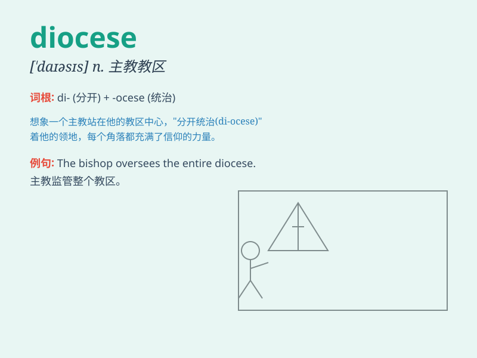

## diocese

**英音:** _[\'daɪəsɪs]_ **美音:** _[\'daɪəsɪs]_

**译义:** *n.主教教区*

### 短语

+ **diocese bishop:** _教区主教_

+ **archdiocese:** _大主教管区_

+ **diocese boundaries:** _教区边界_

+ **diocese administration:** _教区管理_

+ **diocese clergy:** _教区神职人员_

### 例句

#### 例句1

> **The bishop is responsible for the diocese.**

**中文翻译:** 主教对教区负责。

**单词释义:** 教区

#### 例句2

> **The diocese covers a large area of the countryside.**

**中文翻译:** 教区覆盖了大片农村地区。

**单词释义:** 教区

#### 例句3

> **He was transferred to another diocese last year.**

**中文翻译:** 去年他被调往另一个教区。

**单词释义:** 教区

### 背诵小故事

> A young priest was sent to a diocese far away. There, he faced many
challenges but worked hard to serve the people. The diocese became a
place of hope and love because of his efforts.

**一位年轻的牧师被派往一个遥远的教区。在那里，他面临许多挑战，但努力为人们服务。由于他的努力，这个教区变成了一个充满希望和爱的地方。**

### 图义

