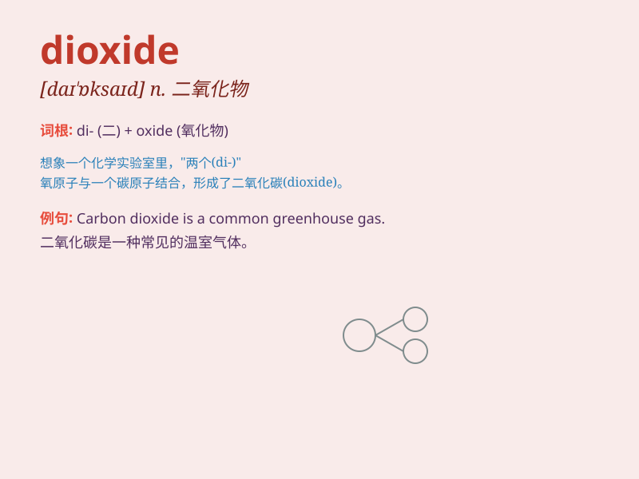

## dioxide

**英音:** _[daɪ\'ɒksaɪd]_ **美音:** _[daɪ\'ɑksaɪd]_

**译义:** *n.二氧化物*

### 短语

+ **carbon dioxide:** _二氧化碳_

+ **sulfur dioxide:** _二氧化硫_

+ **nitrogen dioxide:** _二氧化氮_

+ **chlorine dioxide:** _二氧化氯_

+ **titanium dioxide:** _二氧化钛_

### 例句

#### 例句1

> **Carbon dioxide is a major greenhouse gas.**

**中文翻译:** 二氧化碳是一种主要的温室气体。

**单词释义:** 二氧化碳

#### 例句2

> **Sulfur dioxide emissions must be reduced to protect the
environment.**

**中文翻译:** 为了保护环境，二氧化硫的排放必须减少。

**单词释义:** 二氧化硫

#### 例句3

> **Nitrogen dioxide can cause respiratory problems.**

**中文翻译:** 二氧化氮会导致呼吸问题。

**单词释义:** 二氧化氮

### 背诵小故事

> Imagine a superhero named Dioxide. He has the power to purify the air
by splitting harmful substances. His special ability comes from the
\'di\' meaning two and \'oxide\' referring to oxygen compounds. So,
dioxide is a compound with two oxygen atoms.

**想象有一个超级英雄叫二氧化物。他有通过分解有害物质来净化空气的能力。他的特殊能力来自于'di'表示二，'oxide'指氧的化合物。所以，二氧化物是有两个氧原子的化合物。**

### 图义

