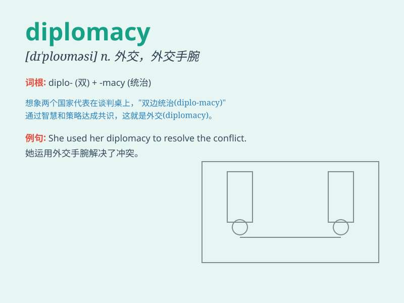

## diplomacy

**英音:** _[dɪ\'pləʊməsɪ]_ **美音:** _[dɪ\'ploməsi]_

**译义:** * 外交*

### 短语

+ **commercial diplomacy:** _商业外交_

+ **public diplomacy:** _公共外交_

+ **shuttle diplomacy:** _穿梭外交_

+ **preventive diplomacy:** _预防性外交_

+ **quiet diplomacy:** _悄悄的外交_

### 例句

#### 例句1

> **The government is skilled in diplomacy to handle international
relations.**

**中文翻译:** 政府在处理国际关系方面擅长外交手段。

**单词释义:** 外交；外交手段

#### 例句2

> **Diplomacy requires a lot of patience and tact.**

**中文翻译:** 外交需要很大的耐心和策略。

**单词释义:** 外交

#### 例句3

> **He has a good understanding of diplomacy and international
law.**

**中文翻译:** 他对外交和国际法有很好的理解。

**单词释义:** 外交

### 背诵小故事

> A king sent his smart son to learn diplomacy. The son met many
foreign envoys, learned to talk smoothly and solve problems peacefully.
Finally, he became a master of diplomacy and brought peace to the
kingdom.

**一位国王派他聪明的儿子去学习外交。儿子会见了许多外国使节，学会了流畅交谈并和平解决问题。最终，他成为了外交大师，为王国带来了和平。**

### 图义

