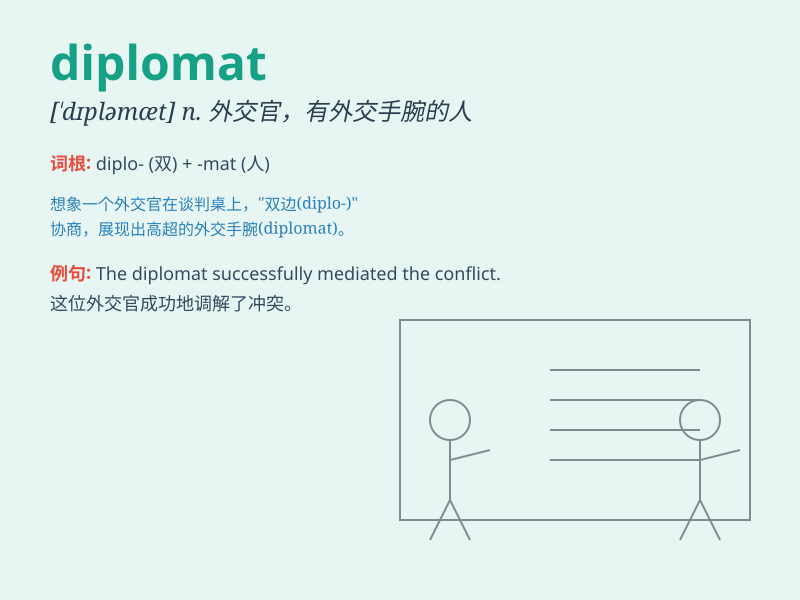

## diplomat

**英音:** _[\'dɪpləmæt]_ **美音:** _[\'dɪpləmæt]_

**译义:** *n.外交官,有外交手腕的人,有权谋的人*

### 短语

+ **career diplomat:** _职业外交官_

+ **senior diplomat:** _高级外交官_

+ **diplomat in residence:** _驻校外交官_

+ **accredited diplomat:** _正式委任的外交官_

+ **roving diplomat:** _巡回外交官_

### 例句

#### 例句1

> **The diplomat was sent on a mission to negotiate a peace
treaty.**

**中文翻译:** 这位外交官被派去执行一项谈判和平条约的任务。

**单词释义:** 外交官

#### 例句2

> **She has the skills and charm to be a successful diplomat.**

**中文翻译:** 她具备成为一名成功外交官的技能和魅力。

**单词释义:** 外交官

#### 例句3

> **The diplomat handled the sensitive issue with diplomacy.**

**中文翻译:** 这位外交官以巧妙的外交手段处理了这个敏感问题。

**单词释义:** 外交官

### 背诵小故事

> A diplomat was sent to a foreign country. He had to be very smart and
polite. He used his wisdom to solve problems and build good
relationships. His job was like a bridge between two different lands.

**一位外交官被派往一个外国。他必须非常聪明和有礼貌。他用他的智慧解决问题并建立良好的关系。他的工作就像两个不同国家之间的桥梁。**

### 图义

