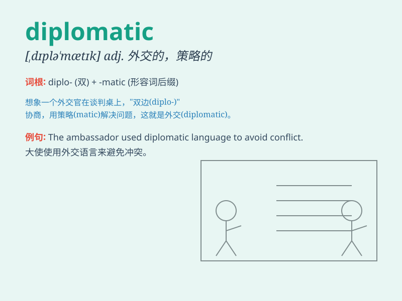

## diplomatic

**英音:** _[dɪplə\'mætɪk]_ **美音:** _[,dɪplə\'mætɪk]_

**译义:** *adj.外交的,老练的*

### 短语

+ **diplomatic relations:** _外交关系_

+ **diplomatic immunity:** _外交豁免权_

+ **diplomatic corps:** _外交使团_

+ **diplomatic channel:** _外交渠道_

+ **diplomatic mission:** _外交使命_

### 例句

#### 例句1

> **He handled the situation in a very diplomatic way.**

**中文翻译:** 他以非常圆滑的方式处理了这种情况。

**单词释义:** 圆滑的；讲究策略的

#### 例句2

> **The diplomat was known for her diplomatic skills.**

**中文翻译:** 这位外交官以她的外交技巧而闻名。

**单词释义:** 外交的；从事外交的

#### 例句3

> **She gave a diplomatic answer to avoid offending anyone.**

**中文翻译:** 她给了一个委婉的回答以避免冒犯任何人。

**单词释义:** 有手腕的；策略的

### 背诵小故事

> A king sent a wise man on a diplomatic mission. The wise man had to
handle tricky situations with tact and skill. He was diplomatic, finding
solutions that pleased everyone and avoided conflicts.

**一位国王派遣一位智者执行外交任务。这位智者必须以机智和技巧处理棘手的情况。他表现得很有外交手腕，找到让每个人都满意且避免冲突的解决方案。**

### 图义

