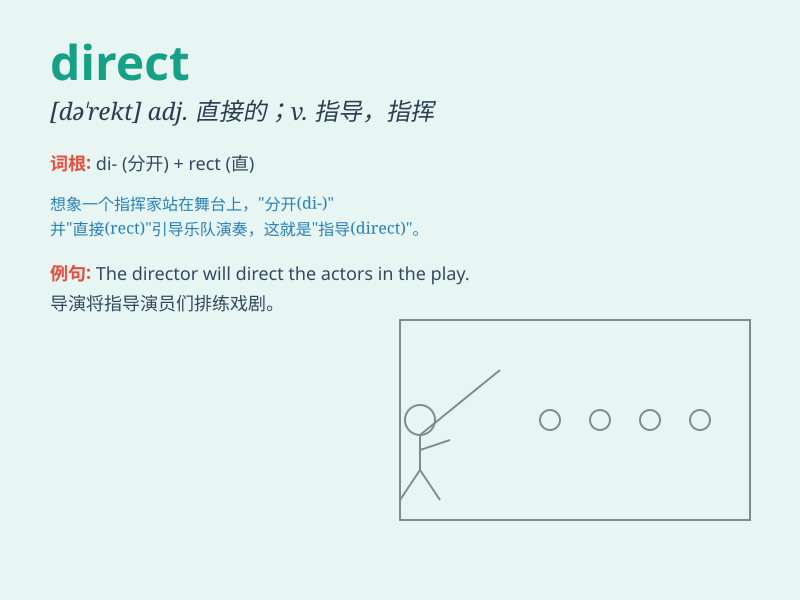

## direct

**英音:** _[dɪˈrekt ; daɪ-]_ **美音:** _[dəˈrekt;
daɪˈrekt]_

**译义:**
*adj.径直的,直接的,直系的,直率的,[天]由西向东运行的,顺行的adv.直接地vt.指引,指示,指挥,命令,导演vi.指导,指挥*

### 短语

+ **direct contact:** _直接接触_

+ **direct flight:** _直飞航班_

+ **direct speech:** _直接引语_

+ **direct current:** _直流电_

+ **direct sale:** _直销_

### 例句

#### 例句1

> **The sign directed us to the right exit.**

**中文翻译:** 这个标志指引我们走向正确的出口。

**单词释义:** 指引；指示

#### 例句2

> **She has a direct way of speaking.**

**中文翻译:** 她说话直截了当。

**单词释义:** 直截了当的；直率的

#### 例句3

> **The movie was directed by a famous director.**

**中文翻译:** 这部电影由一位著名导演执导。

**单词释义:** 导演；指挥

### 背诵小故事

> A lost traveler was wandering in the forest. A kind fairy appeared
and directly pointed the way out. The traveler followed and safely
reached home. The fairy\'s direct action saved the day.

**一位迷路的旅行者在森林里徘徊。一个善良的仙女出现了，直接指出了出路。旅行者跟着走，安全到家。仙女的直接行动挽救了局面。**

### 图义

