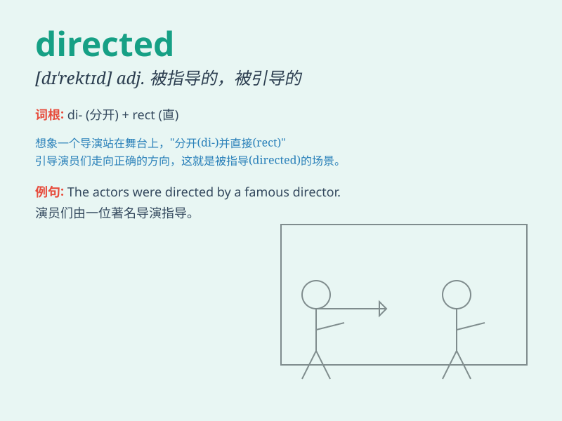

## directed

**英音:** _[dəˈrektɪd]_ **美音:** _[dəˈrektɪd]_

**译义:** *adj.定向的；经指导的；被控制的
v.指导；管理；导演（direct 的过去式和过去分词）*

### 短语

+ **directed at:** _针对；指向_

+ **directed towards:** _朝向；面向_

+ **well directed:** _指挥得当；导向良好_

+ **carefully directed:** _精心指导；谨慎引导_

+ **properly directed:** _正确引导；恰当指挥_

### 例句

#### 例句1

> **The film was directed by a famous director.**

**中文翻译:** 这部电影是由一位著名导演执导的。

**单词释义:** 执导；导演

#### 例句2

> **He directed his anger at me.**

**中文翻译:** 他把怒火指向了我。

**单词释义:** 把...指向；针对

#### 例句3

> **The sign directed us to the right exit.**

**中文翻译:** 这个指示牌指引我们走右边的出口。

**单词释义:** 指引；指示

### 背诵小故事

> A director was in charge of a film. He directed every scene
carefully. The actors followed his directions and the movie turned out
great. Remember, \'directed\' means guided or managed.

**一位导演负责一部电影。他仔细地指导每一个场景。演员们遵循他的指示，电影最终很棒。记住，\'directed\'意思是指导、管理。**

### 图义

