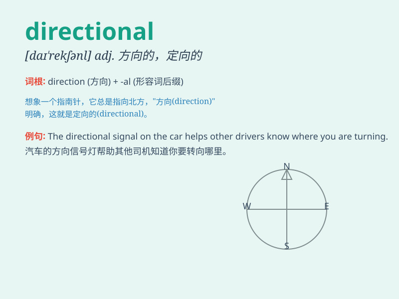

## directional

**英音:** _[dɪ\'rekʃ(ə)n(ə)l; daɪ-]_ **美音:**
_[də\'rɛkʃənl]_

**译义:** *adj.方向的*

### 短语

+ **directional antenna:** _定向天线_

+ **directional drilling:** _定向钻井_

+ **directional light:** _定向光_

+ **directional control:** _方向控制_

+ **directional stability:** _方向稳定性_

### 例句

#### 例句1

> **The antenna has strong directional characteristics.**

**中文翻译:** 这个天线具有很强的方向性特征。

**单词释义:** 方向的；定向的

#### 例句2

> **Directional signs help us find our way in the city.**

**中文翻译:** 方向指示牌帮助我们在城市中找到路。

**单词释义:** 定向的；指示方向的

#### 例句3

> **The company is investing in directional drilling technology.**

**中文翻译:** 这家公司正在投资定向钻井技术。

**单词释义:** 定向的

### 背诵小故事

> A lost traveler was in a big forest. He had no idea which way to go.
But then he found a directional sign that pointed him to the exit. With
its help, he finally got out safely.

**一位迷路的旅行者在一片大森林里。他不知道该往哪走。但随后他发现了一个指示方向的标志，为他指明了出口。在它的帮助下，他最终安全地走了出来。**

### 图义

