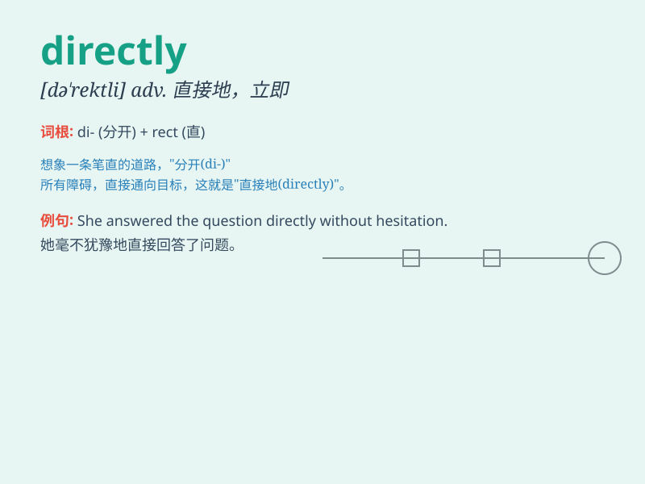

## directly

**英音:** _[dɪ\'rektlɪ; daɪ-]_ **美音:** _[dəˈrɛktli]_

**译义:** *adv.直接地,立即*

### 短语

+ **directly proportional:** _成正比_

+ **directly opposite:** _正对面_

+ **go directly:** _直接去_

+ **speak directly:** _直截了当地说_

+ **directly related:** _直接相关_

### 例句

#### 例句1

> **He answered me directly.**

**中文翻译:** 他直接回答了我。

**单词释义:** 直接地

#### 例句2

> **The train goes directly to Beijing.**

**中文翻译:** 火车直达北京。

**单词释义:** 径直；直接

#### 例句3

> **Come directly after dinner.**

**中文翻译:** 吃完饭直接来。

**单词释义:** 立即；马上

### 背诵小故事

> A lost traveler was seeking directions. A kind local pointed directly
to the right path and said, \'Go that way!\' The traveler followed and
reached his destination safely.

**一位迷路的旅行者正在寻求方向。一位友善的当地人直接指向正确的道路并说：'往那边走！'旅行者照着走，安全到达了目的地。**

### 图义

