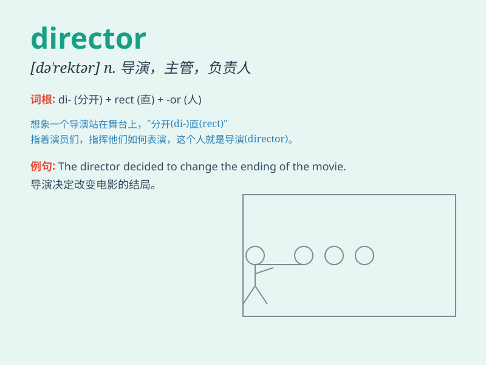

## director

**英音:** _[daɪˈrektə(r); dɪ‑]_ **美音:** _[daɪˈrɛktɚ]_

**译义:**
*n.主任,主管,导演,(机关)首长,(团体)理事,(公司)董事,指挥仪,控制器*

### 短语

+ **film director:** _电影导演_

+ **art director:** _艺术指导_

+ **music director:** _音乐总监_

+ **executive director:** _执行理事；常务董事_

+ **project director:** _项目主管；项目主任_

### 例句

#### 例句1

> **The director of the movie is very famous.**

**中文翻译:** 这部电影的导演很有名。

**单词释义:** 导演

#### 例句2

> **She was appointed as the new director of the company.**

**中文翻译:** 她被任命为公司新任董事。

**单词释义:** 主管；负责人

#### 例句3

> **The director of the charity organization is committed to helping
those in need.**

**中文翻译:** 该慈善组织的负责人致力于帮助有需要的人。

**单词释义:** 负责人；主管

### 背诵小故事

> A director is like a captain of a big ship. Imagine a ship full of
actors and crew. The director decides where the ship goes, how fast, and
what scenes to show. He leads everyone to make a great movie.

**一位导演就像一艘大船的船长。想象一艘装满演员和工作人员的船。导演决定船驶向哪里、速度多快以及展示什么场景。他带领大家制作出一部精彩的电影。**

### 图义

