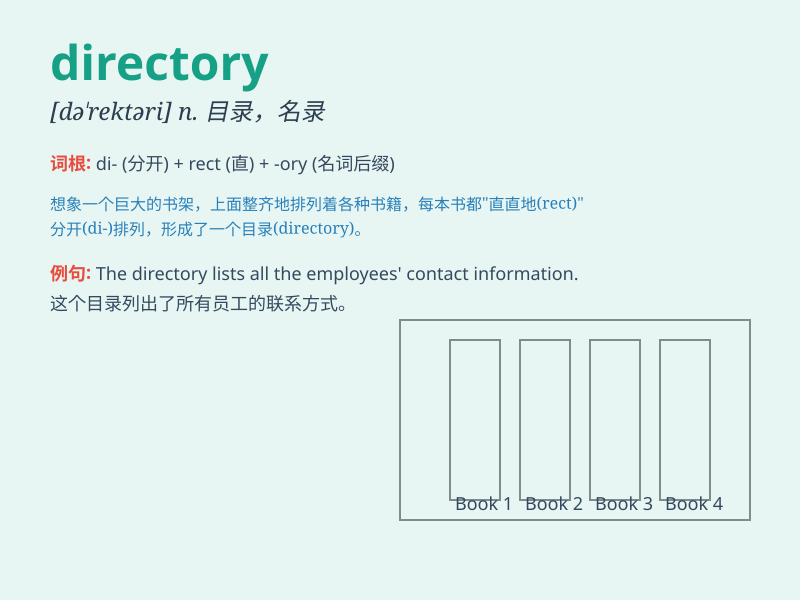

## directory

**英音:** _[dɪ\'rekt(ə)rɪ; daɪ-]_ **美音:** _[dəˈrɛktəri;
(also) daɪˈrɛktəri]_

**译义:** *n.姓名地址录,目录*

### 短语

+ **directory listing:** _目录列表_

+ **phone directory:** _电话簿_

+ **business directory:** _企业名录_

+ **directory service:** _目录服务_

+ **directory structure:** _目录结构_

### 例句

#### 例句1

> **I looked up the number in the directory.**

**中文翻译:** 我在电话簿里查了号码。

**单词释义:** 电话簿；名录

#### 例句2

> **The directory of names and addresses is updated annually.**

**中文翻译:** 姓名和地址目录每年更新一次。

**单词释义:** 名录；目录

#### 例句3

> **You can find the file in the system directory.**

**中文翻译:** 您可以在系统目录中找到该文件。

**单词释义:** 目录

### 背诵小故事

> Imagine a huge library. To find books easily, there is a special list
called a directory. It tells you where each type of book is placed. So,
directory is like that helpful list!

**想象一个巨大的图书馆。为了容易找到书，有一个特殊的列表叫做目录。它告诉你每种类型的书放在哪里。所以，directory
就像那个有用的列表！**

### 图义

