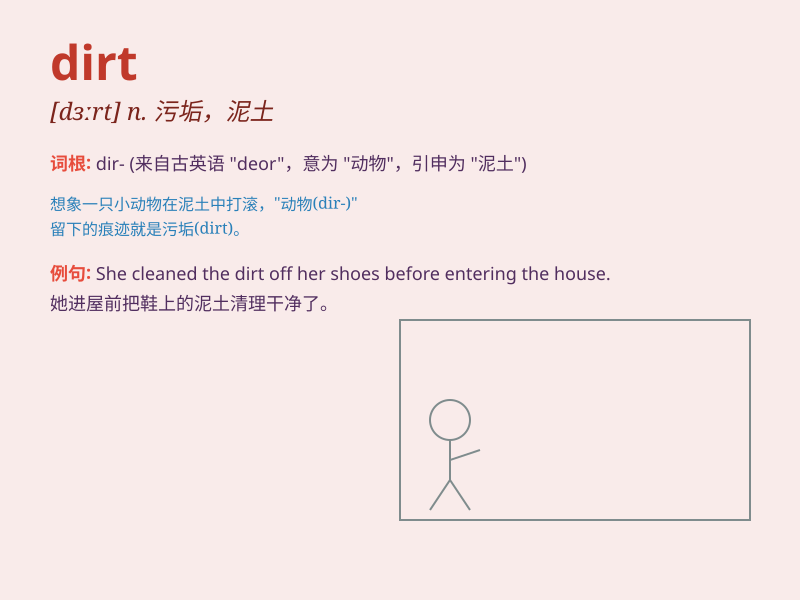

## dirt

**英音:** _[dɜːt]_ **美音:** _[dɝt]_

**译义:** *n.污垢,泥土*

### 短语

+ **dirt road:** _土路；泥路_

+ **dirt cheap:** _非常便宜_

+ **kick up dirt:** _扬起尘土_

+ **dirt bike:** _越野摩托车_

+ **dirt track:** _泥地跑道_

### 例句

#### 例句1

> **The car was covered in dirt after driving on the muddy road.**

**中文翻译:** 汽车在泥泞的道路上行驶后，沾满了泥土。

**单词释义:** 污垢；尘土

#### 例句2

> **He wiped the dirt off his shoes before entering the house.**

**中文翻译:** 进屋前，他擦掉了鞋子上的泥土。

**单词释义:** 泥土；污物

#### 例句3

> **The workers were digging in the dirt to lay the foundation of the
building.**

**中文翻译:** 工人们正在挖土，为大楼打地基。

**单词释义:** 泥土；土壤

### 背诵小故事

> One day, Tom was playing in the garden and got his hands full of
dirt. His mother told him to wash it off quickly. Dirt here means the
soil or filth on the ground.

**一天，汤姆在花园里玩耍，手上沾满了泥土。他妈妈让他赶紧洗掉。这里的
dirt 指的是地面上的泥土或污物。**

### 图义

