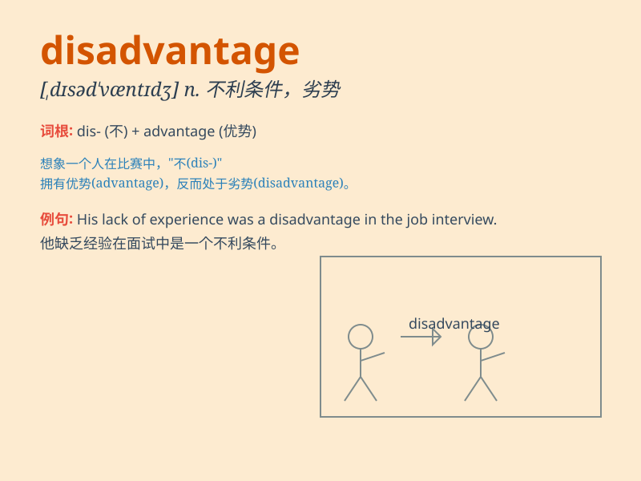

## disadvantage

**英音:** _[dɪsəd\'vɑːntɪdʒ]_ **美音:**
_[,dɪsəd\'væntɪdʒ]_

**译义:** *n.不利,不利条件,缺点,劣势*

### 短语

+ **disadvantage factor:** _不利因素；不利因子_

+ **at a disadvantage:** _处于不利地位_

+ **competitive disadvantage:** _竞争劣势_

+ **disadvantage position:** _不利位置；劣势地位_

+ **economic disadvantage:** _经济劣势_

### 例句

#### 例句1

> **One disadvantage of living in the countryside is the lack of
public transportation.**

**中文翻译:** 生活在乡村的缺点之一是缺乏公共交通。

**单词释义:** 缺点；不利条件

#### 例句2

> **The main disadvantage of this method is its high cost.**

**中文翻译:** 该方法的主要缺点是成本高。

**单词释义:** 不利之处

#### 例句3

> **He was at a disadvantage in the race because of his injury.**

**中文翻译:** 由于受伤，他在比赛中处于劣势。

**单词释义:** 不利地位

### 背诵小故事

> One day, Tom wanted to join a basketball team. But he was too short,
which was a disadvantage. He couldn\'t reach the hoop easily and was
often overlooked. Poor Tom!

**有一天，汤姆想加入篮球队。但他太矮了，这是一个劣势。他不容易够到篮筐，还经常被忽视。可怜的汤姆！**

### 图义

