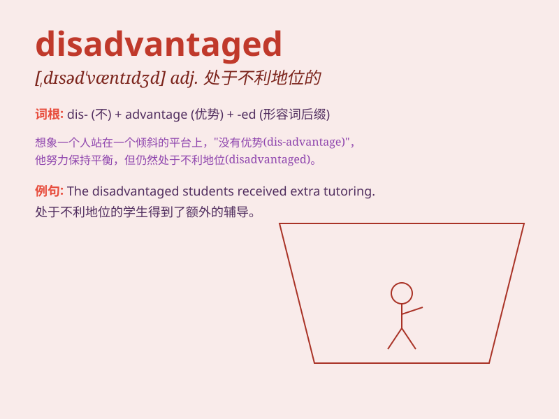

## disadvantaged

**英音:** _[dɪsəd\'vɑːntɪdʒd]_ **美音:**
_[,dɪsəd\'væntɪdʒd]_

**译义:** *adj.贫穷的,处于不利地位的*

### 短语

+ **disadvantaged group:** _弱势群体_

+ **disadvantaged background:** _不利的背景_

+ **disadvantaged area:** _贫困地区_

+ **disadvantaged position:** _不利地位_

+ **disadvantaged children:** _贫困儿童_

### 例句

#### 例句1

> **Children from disadvantaged families often face more challenges
in education.**

**中文翻译:** 弱势家庭的孩子在教育上往往面临更多挑战。

**单词释义:** 贫困的；处于不利地位的

#### 例句2

> **The disadvantaged group needs more support and care from
society.**

**中文翻译:** 弱势群体需要社会更多的支持和关爱。

**单词释义:** 处于不利地位的；弱势的

#### 例句3

> **She has been working hard to help the disadvantaged in the
community.**

**中文翻译:** 她一直努力帮助社会上的弱势群体。

**单词释义:** 弱势的；处于不利地位的

### 背诵小故事

> In a small town, there was a group of disadvantaged children. They
had no nice toys or enough food. But they never gave up. With hard work,
they slowly changed their situation. Disadvantaged means in an
unfavorable position.

**在一个小镇上，有一群处于不利地位的孩子。他们没有好玩具，也没有足够的食物。但他们从不放弃。通过努力，他们慢慢改变了自己的处境。disadvantaged
意思是处于不利地位的。**

### 图义

