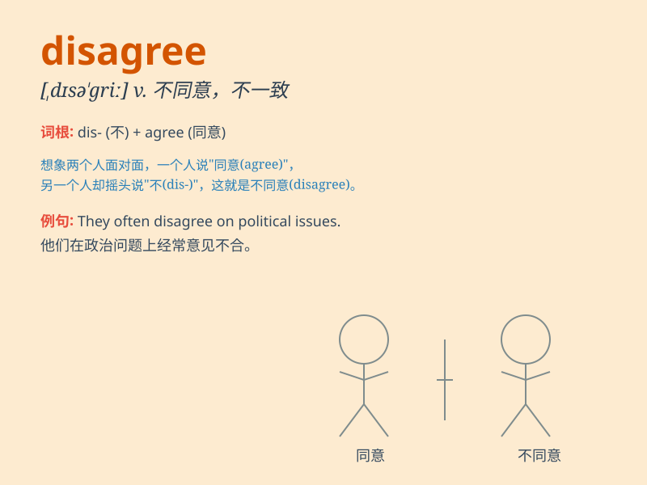

## disagree

**英音:** _[dɪsə\'griː]_ **美音:** _[,dɪsə\'ɡri]_

**译义:** *vi.不一致,不适宜*

### 短语

+ **disagree with:** _不同意；与\...\...意见不一致_

+ **disagree on:** _在\...\...方面存在分歧_

+ **strongly disagree:** _强烈不同意_

+ **totally disagree:** _完全不同意_

+ **disagree about:** _关于\...\...有不同意见_

### 例句

#### 例句1

> **I disagree with your opinion on this matter.**

**中文翻译:** 我不同意你对这件事的看法。

**单词释义:** 不同意

#### 例句2

> **They often disagree about which movie to watch.**

**中文翻译:** 他们经常对看哪部电影意见不一。

**单词释义:** 意见不合

#### 例句3

> **The two experts strongly disagree on the research method.**

**中文翻译:** 两位专家对研究方法存在强烈分歧。

**单词释义:** 持有不同意见

### 背诵小故事

> One day, Tom and Jerry had a discussion about which ice cream flavor
was better. Tom liked chocolate, but Jerry preferred vanilla. They
started to argue and DISAGREE with each other loudly.

**一天，汤姆和杰瑞在讨论哪种冰淇淋口味更好。汤姆喜欢巧克力味的，但是杰瑞更喜欢香草味的。他们开始争论，大声地彼此不同意。**

### 图义

