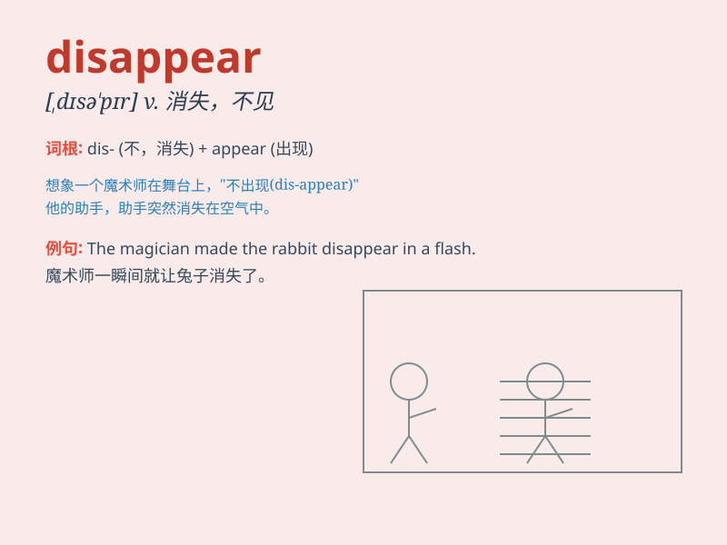

## disappear

**英音:** _[dɪsə\'pɪə]_ **美音:** _[\'dɪsə\'pɪr]_

**译义:** *vi.消失,不见*

### 短语

+ **disappear from:** _从\...消失_

+ **disappear suddenly:** _突然消失_

+ **disappear completely:** _完全消失_

+ **disappear without a trace:** _消失得无影无踪_

+ **disappear gradually:** _逐渐消失_

### 例句

#### 例句1

> **The plane disappeared behind a cloud.**

**中文翻译:** 飞机消失在云层后面。

**单词释义:** 消失

#### 例句2

> **The smile disappeared from her face.**

**中文翻译:** 笑容从她脸上消失了。

**单词释义:** 消失

#### 例句3

> **Many species of animals have disappeared due to human
activities.**

**中文翻译:** 由于人类活动，许多动物物种已经消失。

**单词释义:** 消失；灭绝

### 背诵小故事

> One day, a little rabbit was playing in the forest. Suddenly, a big
storm came and everything around became dark. When the storm passed, the
little rabbit disappeared. No one could find it. It seemed to vanish
into thin air.

**有一天，一只小兔子正在森林里玩耍。突然，一场大风暴来临，周围一切变得昏暗。风暴过后，小兔子消失了。没人能找到它。它似乎凭空消失了。**

### 图义

