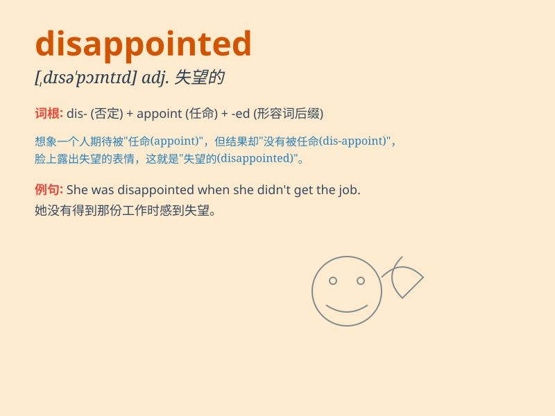

## disappointed

**英音:** _[dɪsə\'pɒɪntɪd]_ **美音:**
_[\'dɪsə\'pɔɪntɪd]_

**译义:** *adj.失望的*

### 短语

+ **be disappointed in:** _对\...\...感到失望_

+ **be disappointed with:** _对\...\...感到失望_

+ **disappointed at:** _对\...\...感到失望_

+ **feel disappointed:** _感到失望_

+ **deeply disappointed:** _深感失望_

### 例句

#### 例句1

> **I was very disappointed when I didn\'t get the job.**

**中文翻译:** 当我没有得到这份工作时，我感到非常失望。

**单词释义:** 感到失望的

#### 例句2

> **She looked disappointed at the news.**

**中文翻译:** 她对这个消息显得很失望。

**单词释义:** 失望的

#### 例句3

> **The disappointed fans left the stadium early.**

**中文翻译:** 失望的球迷提前离开了球场。

**单词释义:** 失望的

### 背诵小故事

> A boy had high hopes of getting a new bike on his birthday. But when
the day came, there was no bike. He felt very disappointed. His smile
vanished and his heart sank.

**一个男孩满心期待在生日时能得到一辆新自行车。但生日那天，并没有自行车。他感到非常失望。他的笑容消失了，心情也低落了。**

### 图义

