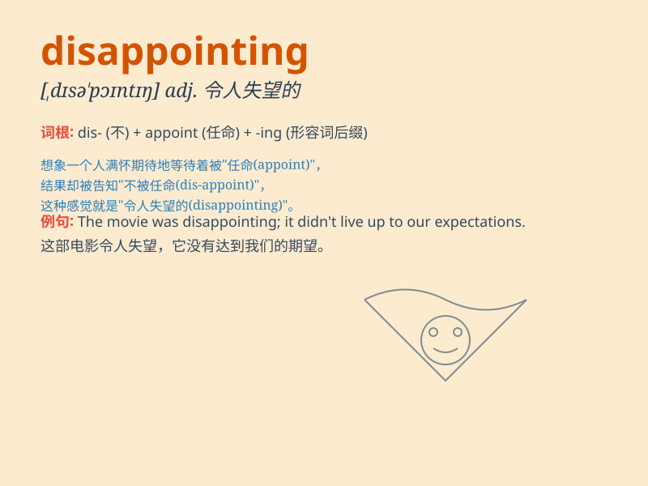

## disappointing

**英音:** _[dɪsə\'pɒɪntɪŋ]_ **美音:** _[,dɪsə\'pɔɪntɪŋ]_

**译义:** *adj.使人失望的,令人失望的*

### 短语

+ **disappointing result:** _令人失望的结果_

+ **disappointing performance:** _令人失望的表现_

+ **disappointing news:** _令人失望的消息_

+ **disappointing experience:** _令人失望的经历_

+ **disappointing turnout:** _令人失望的出席人数_

### 例句

#### 例句1

> **The movie was very disappointing.**

**中文翻译:** 这部电影非常令人失望。

**单词释义:** 令人失望的

#### 例句2

> **The results of the exam were disappointing.**

**中文翻译:** 考试的结果令人失望。

**单词释义:** 令人失望的

#### 例句3

> **His performance in the game was disappointing.**

**中文翻译:** 他在比赛中的表现令人失望。

**单词释义:** 令人失望的

### 背诵小故事

> A boy expected to win the game but failed. His performance was
disappointing. His parents and friends were all sad because of it. They
had high hopes for him but he let them down.

**一个男孩期望赢得比赛但失败了。他的表现令人失望。他的父母和朋友都因此而伤心。他们对他寄予厚望，但他让他们失望了。**

### 图义

