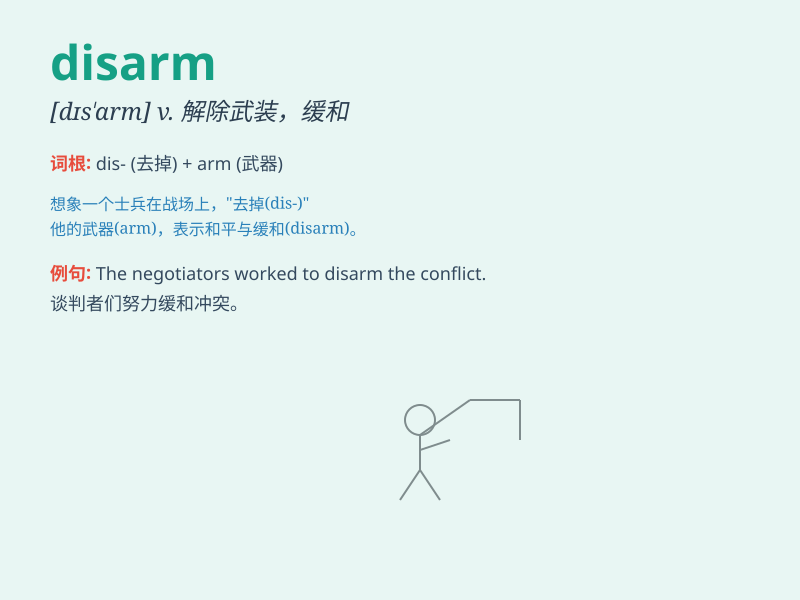

## disarm

**英音:** _[dɪs\'ɑːm]_ **美音:** _[dɪs\'ɑrm]_

**译义:**
*vt.解除武装,回复平常的编制,缓和,消除(敌意,疑虑)vi.放下武器*

### 短语

+ **disarm completely:** _完全解除武装_

+ **disarm illegally:** _非法解除武装_

+ **disarm gradually:** _逐步解除武装_

+ **disarm peacefully:** _和平解除武装_

+ **disarm voluntarily:** _自愿解除武装_

### 例句

#### 例句1

> **The government decided to disarm the rebel forces.**

**中文翻译:** 政府决定解除叛军武装。

**单词释义:** 解除......的武装

#### 例句2

> **His smile disarmed her anger.**

**中文翻译:** 他的微笑消除了她的愤怒。

**单词释义:** 消除（某人的怒气、疑虑等）

#### 例句3

> **She managed to disarm the security system.**

**中文翻译:** 她设法解除了安全系统的武装。

**单词释义:** 解除（警报等）；消除（危险等）

### 背诵小故事

> A brave soldier decided to disarm the enemy. He bravely approached
and convinced them to lay down their weapons. Through his courage and
persuasion, peace was restored.

**一位勇敢的士兵决定解除敌人的武装。他勇敢地靠近并说服他们放下武器。通过他的勇气和劝说，和平得以恢复。**

### 图义

