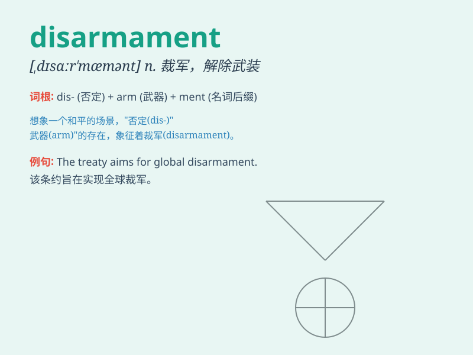

## disarmament

**英音:** _[dɪs\'ɑːməm(ə)nt]_ **美音:**
_[dɪs\'ɑrməmənt]_

**译义:** *n.裁军*

### 短语

+ **nuclear disarmament:** _核裁军_

+ **global disarmament:** _全球裁军_

+ **disarmament conference:** _裁军会议_

+ **disarmament process:** _裁军进程_

+ **disarmament treaty:** _裁军条约_

### 例句

#### 例句1

> **The international community has been striving for disarmament for
decades.**

**中文翻译:** 几十年来，国际社会一直在努力实现裁军。

**单词释义:** 裁军

#### 例句2

> **Disarmament is an important issue for global peace and
security.**

**中文翻译:** 裁军是全球和平与安全的重要问题。

**单词释义:** 裁军

#### 例句3

> **The conference focused on the progress of disarmament.**

**中文翻译:** 会议重点讨论了裁军进展情况。

**单词释义:** 裁军

### 背诵小故事

> In a war-torn world, people were tired of fighting. So, they decided
on disarmament. They put down their weapons and chose peace. Disarmament
meant getting rid of all the dangerous arms to create a safer place.

**在一个饱受战争蹂躏的世界里，人们厌倦了战斗。于是，他们决定裁军。他们放下武器，选择了和平。裁军意味着摆脱所有危险的武器，以创造一个更安全的地方。**

### 图义

