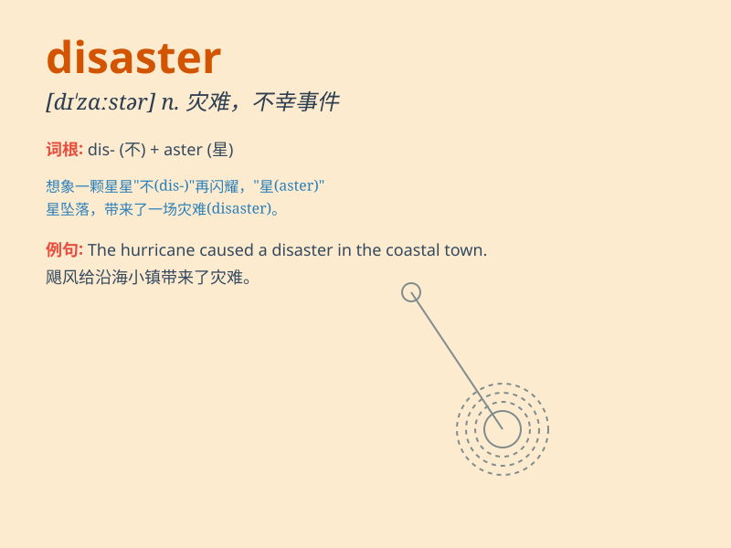

## disaster

**英音:** _[dɪ\'zɑːstə]_ **美音:** _[dɪ\'zæstɚ]_

**译义:** *n.灾难,天灾,灾祸*

### 短语

+ **natural disaster:** _自然灾害_

+ **disaster area:** _灾区_

+ **disaster relief:** _救灾_

+ **major disaster:** _重大灾难_

+ **prevent a disaster:** _预防灾难_

### 例句

#### 例句1

> **The earthquake was a major disaster for the region.**

**中文翻译:** 这次地震对该地区来说是一场重大灾难。

**单词释义:** 灾难

#### 例句2

> **His investment turned out to be a disaster.**

**中文翻译:** 他的投资结果是一场灾难。

**单词释义:** 灾祸；不幸

#### 例句3

> **The flood brought disaster to the small village.**

**中文翻译:** 洪水给这个小村庄带来了灾难。

**单词释义:** 灾难；祸患

### 背诵小故事

>
想象一艘大船在海上航行，突然遭遇强烈风暴，船被吹得东倒西歪（dis），货物掉落，乘客惊慌。这可怕的一幕就是一场灾难（disaster）。

**想象一艘大船在海上遭遇风暴的场景来辅助记忆单词 disaster（灾难）**

### 图义

