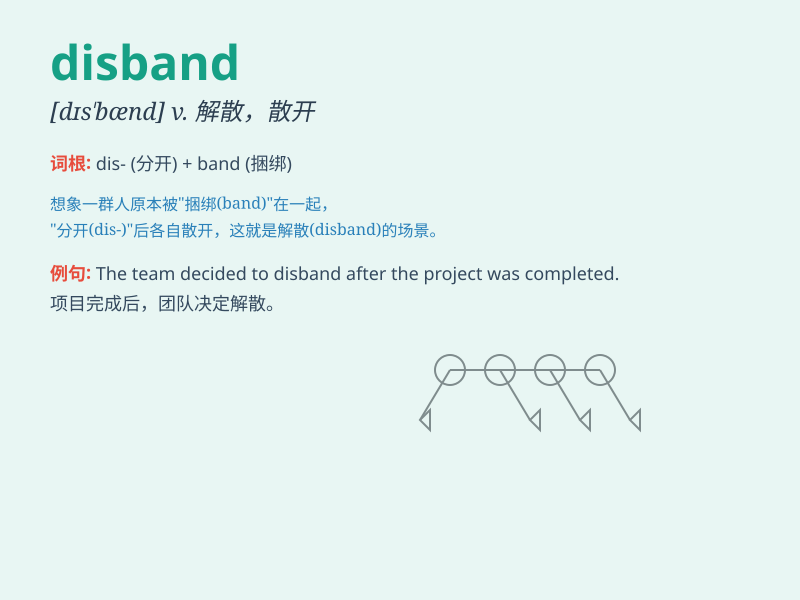

## disband

**英音:** _[dɪs\'bænd]_ **美音:** _[dɪs\'bænd]_

**译义:** *v.解散,裁减*

### 短语

+ **disband an army:** _解散军队_

+ **disband a club:** _解散俱乐部_

+ **disband a gang:** _解散帮派_

+ **disband a committee:** _解散委员会_

+ **disband a team:** _解散团队_

### 例句

#### 例句1

> **The club was forced to disband due to lack of funds.**

**中文翻译:** 俱乐部因缺乏资金而被迫解散。

**单词释义:** 解散

#### 例句2

> **The army unit was ordered to disband after the war ended.**

**中文翻译:** 战争结束后，该部队被勒令解散。

**单词释义:** 解散

#### 例句3

> **The illegal organization was disbanded by the authorities.**

**中文翻译:** 该非法组织已被当局解散。

**单词释义:** 解散

### 背诵小故事

> A group of musicians was formed, but due to various problems, they
decided to disband. It means to break up or stop functioning as a group.
Just like this band ended its existence.

**一群音乐家组成了乐队，但由于各种问题，他们决定解散。disband
这个词意思就是解散、解体。就像这个乐队结束了它的存在。**

### 图义

