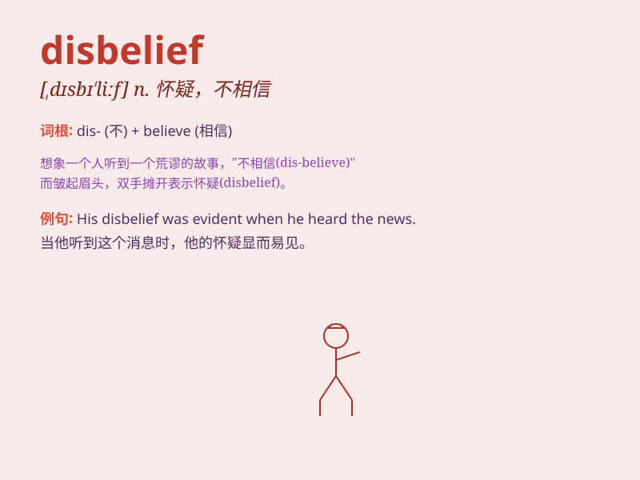

## disbelief

**英音:** _[dɪsbɪ\'liːf]_ **美音:** _[,dɪsbɪ\'lif]_

**译义:** *n.怀疑*

### 短语

+ **in disbelief:** _不相信；怀疑地_

+ **express disbelief:** _表示不相信_

+ **shake one\'s head in disbelief:** _难以置信地摇头_

+ **stare in disbelief:** _难以置信地凝视_

+ **a look of disbelief:** _怀疑的神情_

### 例句

#### 例句1

> **She stared at him in disbelief, unable to believe what she was
hearing.**

**中文翻译:** 她不可置信地看着他，不敢相信自己所听到的。

**单词释义:** 不相信；怀疑

#### 例句2

> **His expression showed disbelief when I told him the news.**

**中文翻译:** 当我告诉他这个消息时，他的表情流露出难以置信。

**单词释义:** 不相信；怀疑

#### 例句3

> **They listened to his story with disbelief, thinking it was too
far-fetched.**

**中文翻译:** 他们难以置信地听着他的故事，认为这太牵强了。

**单词释义:** 怀疑；不相信

### 背诵小故事

> One day, Tom claimed he could fly. Everyone looked at him in
disbelief. They couldn\'t believe such an impossible thing. But Tom
insisted, making them shake their heads even more.

**有一天，汤姆声称他能飞。每个人都难以置信地看着他。他们无法相信这么不可能的事情。但汤姆坚持，让他们更加摇头了。**

### 图义

