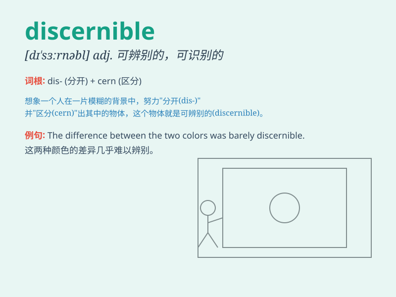

## discernible

**英音:** _[dɪ\'sɜːnɪbl]_ **美音:** _[dɪ\'zɝnəbl]_

**译义:** *adj.可辨别的*

### 短语

+ **discernible difference:** _可察觉的差异_

+ **discernible pattern:** _可识别的模式_

+ **discernible change:** _可辨别的变化_

+ **discernible feature:** _可分辨的特征_

+ **discernible sign:** _可察觉的迹象_

### 例句

#### 例句1

> **The difference between the two paintings was barely
discernible.**

**中文翻译:** 两幅画之间的差异几乎无法辨别。

**单词释义:** 可辨别的；可识别的

#### 例句2

> **A discernible change has taken place in the economy.**

**中文翻译:** 经济发生了明显的变化。

**单词释义:** 明显的；可察觉的

#### 例句3

> **The outline of the building was just discernible in the fog.**

**中文翻译:** 雾气中，建筑物的轮廓依稀可见。

**单词释义:** 可看清的；能分辨的

### 背诵小故事

> A detective was on a case. In a dark room, he used a special torch
and could just make out some discernible footprints. They led him to the
truth. It means capable of being recognized or distinguished.

**一位侦探在办案。在一个黑暗的房间里，他用了一个特殊的手电筒，刚好能辨认出一些可分辨的脚印。它们引领他找到了真相。这个词意思是能够被认出或区分的。**

### 图义

