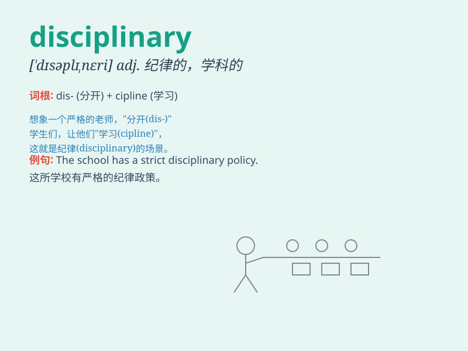

## disciplinary

**英音:** _[\'dɪsɪplɪn(ə)rɪ; ,dɪsɪ\'plɪn-]_ **美音:**
_[\'dɪsəplənɛri]_

**译义:** *adj.训练的,训诫的,规律的*

### 短语

+ **disciplinary action:** _纪律处分；惩戒行动_

+ **disciplinary committee:** _纪律委员会_

+ **disciplinary measure:** _纪律措施_

+ **disciplinary problem:** _纪律问题_

+ **disciplinary training:** _纪律训练_

### 例句

#### 例句1

> **The company has strict disciplinary measures for employees who
violate the rules.**

**中文翻译:** 公司对违规员工有严格的纪律处分。

**单词释义:** 纪律的；惩戒性的

#### 例句2

> **He faced disciplinary action after being caught cheating in the
exam.**

**中文翻译:** 他在考试作弊被抓后面临纪律处分。

**单词释义:** 纪律处分的

#### 例句3

> **The school\'s disciplinary committee is responsible for
maintaining order.**

**中文翻译:** 学校纪律委员会负责维持秩序。

**单词释义:** 纪律的

### 背诵小故事

> A student was often late for class. The teacher gave him disciplinary
actions, like extra homework. This made the student realize the
importance of discipline. Disciplinary means related to punishment for
bad behavior.

**一个学生经常上课迟到。老师对他采取了纪律处分，比如额外的作业。这让学生意识到纪律的重要性。Disciplinary
意思是与对不良行为的惩罚有关。**

### 图义

