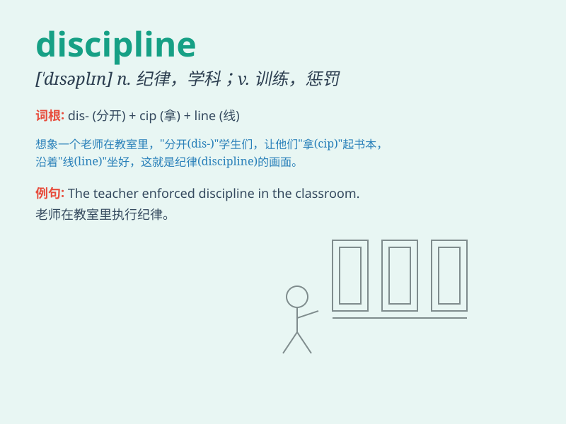

## discipline

**英音:** _[\'dɪsɪplɪn]_ **美音:** _[\'dɪsəplɪn]_

**译义:** *n.纪律,学科v.训练*

### 短语

+ **academic discipline:** _学术学科_

+ **self-discipline:** _自律；自我约束_

+ **disciplinary action:** _纪律处分；惩戒行动_

+ **intellectual discipline:** _知识学科_

+ **discipline oneself:** _约束自己；自我克制_

### 例句

#### 例句1

> **She has great discipline when it comes to studying.**

**中文翻译:** 她在学习方面有很强的纪律性。

**单词释义:** 自律；自我约束

#### 例句2

> **The school has strict discipline policies.**

**中文翻译:** 学校有严格的纪律政策。

**单词释义:** 纪律；规章制度

#### 例句3

> **Discipline is necessary for success in any field.**

**中文翻译:** 纪律对于任何领域的成功都是必要的。

**单词释义:** 纪律；训练

### 背诵小故事

> A student was always late and had messy homework. But with the
teacher\'s discipline, he learned to be punctual and organized.
Discipline made him a better student.

**一个学生总是迟到，作业也乱七八糟。但在老师的管教下，他学会了守时和有条理。纪律让他成为了更好的学生。**

### 图义

