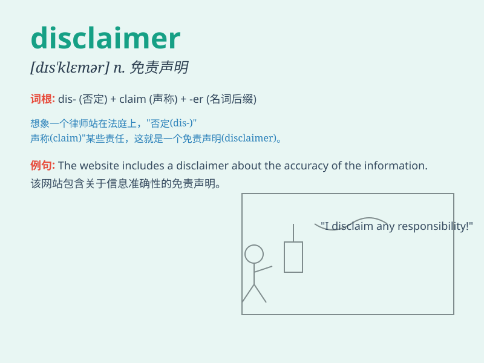

## disclaimer

**英音:** _[dɪs\'kleɪmə]_ **美音:** _[dɪs\'klemɚ]_

**译义:** *n.放弃,拒绝,放弃者,不承诺*

### 短语

+ **liability disclaimer:** _责任免除声明_

+ **product disclaimer:** _产品免责声明_

+ **health disclaimer:** _健康免责声明_

+ **copyright disclaimer:** _版权免责声明_

+ **disclaimer of warranty:** _保修免责声明_

### 例句

#### 例句1

> **The website has a disclaimer stating that the information
provided is for reference only.**

**中文翻译:** 该网站有免责声明，声明所提供的信息仅供参考。

**单词释义:** 免责声明

#### 例句2

> **Please read the disclaimer carefully before using the
product.**

**中文翻译:** 使用产品前请仔细阅读免责声明。

**单词释义:** 免责声明

#### 例句3

> **The company issued a disclaimer to avoid potential legal
issues.**

**中文翻译:** 该公司发布免责声明以避免潜在的法律问题。

**单词释义:** 免责声明

### 背诵小故事

> A company was about to launch a new product but added a disclaimer
that it might have minor flaws. People were confused. Later, they
understood that disclaimer means a statement that denies responsibility
or limits liability.

**一家公司即将推出一款新产品，但添加了一份免责声明，称其可能存在小瑕疵。人们感到困惑。后来，他们明白了disclaimer指的是拒绝承担责任或限制责任的声明。**

### 图义

