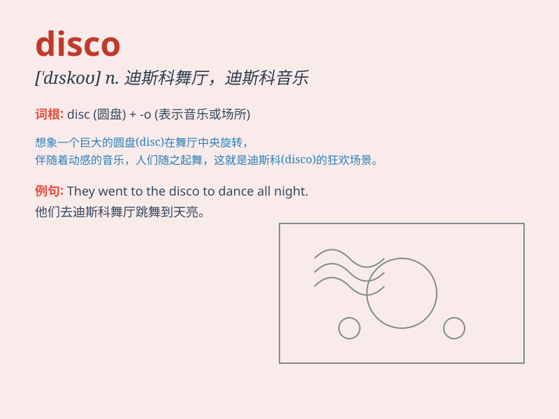

## disco

**英音:** _[\'dɪskəʊ]_ **美音:** _[\'dɪsko]_

**译义:** *
discothequen.迪斯科舞,以唱片伴奏的小舞厅;v.进迪斯科舞厅*

### 短语

+ **disco music:** _迪斯科音乐_

+ **disco dance:** _迪斯科舞_

+ **disco fever:** _迪斯科热_

+ **disco ball:** _迪斯科球_

+ **disco party:** _迪斯科舞会_

### 例句

#### 例句1

> **I love going to disco parties on weekends.**

**中文翻译:** 我喜欢周末去迪斯科舞会。

**单词释义:** 迪斯科舞会

#### 例句2

> **The disco music made everyone dance excitedly.**

**中文翻译:** 迪斯科音乐让大家兴奋得手舞足蹈。

**单词释义:** 迪斯科音乐

#### 例句3

> **She wore a shiny dress to the disco.**

**中文翻译:** 她穿着一件闪亮的裙子去迪斯科舞厅。

**单词释义:** 迪斯科厅

### 背诵小故事

> One night, I entered a club full of flashing lights and energetic
music. People were dancing freely on the floor. I asked a friend, \'What
kind of place is this?\' He shouted, \'This is a disco!\'

**一天晚上，我走进一家灯光闪烁、音乐充满活力的俱乐部。人们在舞池里自由地跳舞。我问一个朋友：'这是什么样的地方？'他大喊：'这是一家迪斯科舞厅！'**

### 图义

