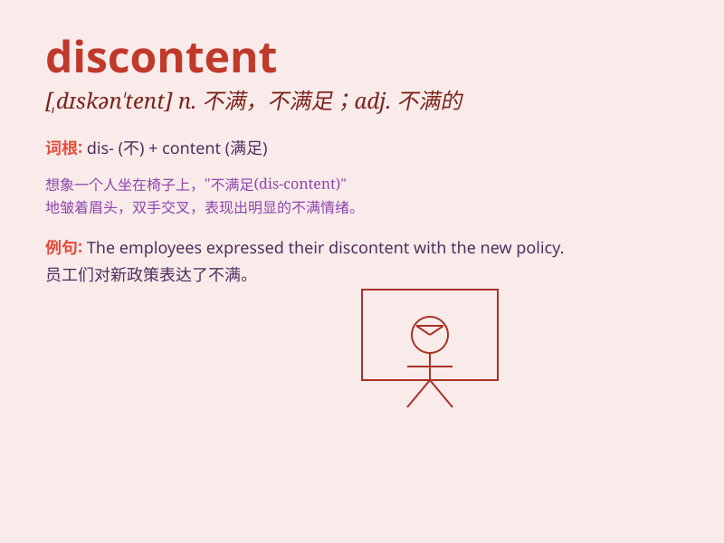

## discontent

**英音:** _[dɪskən\'tent]_ **美音:** _[,dɪskən\'tɛnt]_

**译义:** *n.不满*

### 短语

+ **discontent with:** _对\...\...不满_

+ **general discontent:** _普遍的不满_

+ **social discontent:** _社会的不满_

+ **express discontent:** _表达不满_

+ **growing discontent:** _日益增长的不满_

### 例句

#### 例句1

> **There is growing discontent among the workers over low pay.**

**中文翻译:** 工人们对低工资的不满情绪日益高涨。

**单词释义:** 不满；不满意

#### 例句2

> **The discontent of the citizens led to protests in the
streets.**

**中文翻译:** 民众的不满情绪引发街头抗议。

**单词释义:** 不满；不满足

#### 例句3

> **His expression showed his discontent with the decision.**

**中文翻译:** 他的表情表明了他对这个决定的不满。

**单词释义:** 不满；不悦

### 背诵小故事

> A king was always unhappy and showed discontent. His subjects were
puzzled. One wise man told them the king was discontent because he had
lost the joy of simple things. So, discontent means being unhappy or
dissatisfied.

**一位国王总是不开心，表现出不满。他的臣民很困惑。一位智者告诉他们，国王不满是因为他失去了对简单事物的乐趣。所以，discontent
意思是不开心或不满意。**

### 图义

