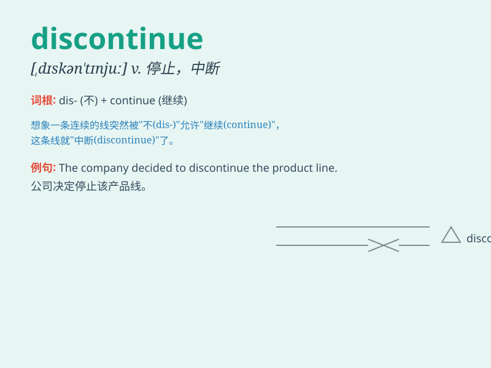

## discontinue

**英音:** _[dɪskən\'tɪnjuː]_ **美音:**
_[,dɪskən\'tɪnju]_

**译义:** *v.停止,废止,放弃*

### 短语

+ **discontinue doing sth:** _停止做某事_

+ **discontinue production:** _停止生产_

+ **discontinue a service:** _停止一项服务_

+ **discontinue a habit:** _改掉一个习惯_

+ **discontinue medication:** _停止用药_

### 例句

#### 例句1

> **The company has decided to discontinue that product line.**

**中文翻译:** 该公司已决定停止该产品线。

**单词释义:** 停止，终止

#### 例句2

> **They had to discontinue the project due to lack of funds.**

**中文翻译:** 由于缺乏资金，他们不得不终止该项目。

**单词释义:** 中止，中断

#### 例句3

> **The doctor advised her to discontinue the medication.**

**中文翻译:** 医生建议她停止服药。

**单词释义:** 停止，停用

### 背诵小故事

> A factory was making a certain product, but due to some problems,
they had to discontinue it. Workers were sad as they stopped the
production line. \'Discontinue\' means to stop doing or providing
something.

**一家工厂正在生产某种产品，但由于一些问题，他们不得不停止生产。工人们很伤心，因为他们关停了生产线。'discontinue'的意思是停止做某事或停止提供某物。**

### 图义

