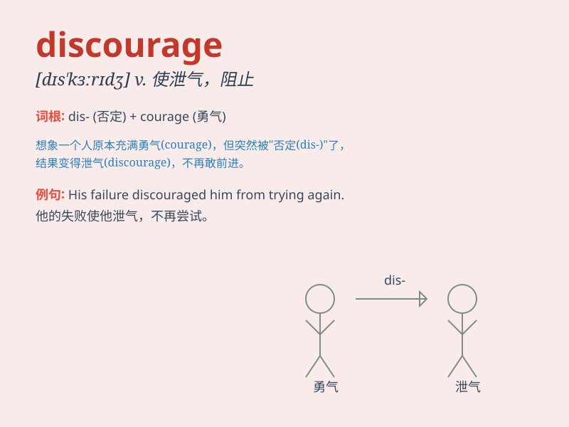

## discourage

**英音:** _[dɪs\'kʌrɪdʒ]_ **美音:** _[dɪs\'kɝɪdʒ]_

**译义:** *vt.使气馁,阻碍*

### 短语

+ **discourage sb from doing sth:** _劝阻某人做某事_

+ **be discouraged at:** _对\...\...感到气馁_

+ **discourage bad behavior:** _遏制不良行为_

+ **discourage competition:** _抑制竞争_

+ **discourage investment:** _阻碍投资_

### 例句

#### 例句1

> **The high cost of the project discouraged many investors.**

**中文翻译:** 这个项目的高成本让许多投资者望而却步。

**单词释义:** 使气馁，使沮丧，使打消念头

#### 例句2

> **Parents should not discourage children from asking questions.**

**中文翻译:** 父母不应该阻止孩子提问。

**单词释义:** 阻止，阻拦

#### 例句3

> **The bad weather discouraged us from going hiking.**

**中文翻译:** 恶劣的天气使我们打消了去徒步旅行的念头。

**单词释义:** 使失去信心，使泄气

### 背诵小故事

> A young artist was often criticized. This made him feel down and want
to give up. But his friend said, \'Don\'t be discouraged. Keep going!\'
So he found the courage to continue. \'Discourage\' means to make
someone lose confidence or enthusiasm.

**一位年轻的艺术家经常被批评。这使他感到沮丧并想要放弃。但他的朋友说：'别灰心。继续！'于是他重新鼓起勇气继续。'discourage'意思是使某人失去信心或热情。**

### 图义

