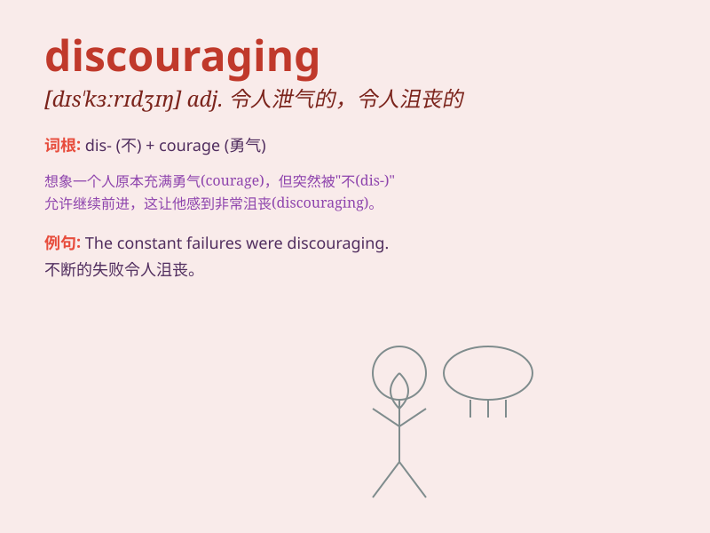

## discouraging

**英音:** _[dɪsˈkʌrɪdʒɪŋ]_ **美音:** _[dɪsˈkɜːrɪdʒɪŋ]_

**译义:** *adj.令人气馁的*

### 短语

+ **discouraging result:** _令人沮丧的结果_

+ **discouraging news:** _令人泄气的消息_

+ **discouraging situation:** _令人沮丧的形势_

+ **discouraging outlook:** _令人沮丧的前景_

+ **discouraging experience:** _令人沮丧的经历_

### 例句

#### 例句1

> **The exam results were very discouraging.**

**中文翻译:** 这次考试的结果非常令人沮丧。

**单词释义:** 令人沮丧的

#### 例句2

> **The discouraging news made him lose hope.**

**中文翻译:** 这个令人沮丧的消息使他失去了希望。

**单词释义:** 令人沮丧的

#### 例句3

> **It\'s discouraging to see so much waste.**

**中文翻译:** 看到这么多浪费的现象令人沮丧。

**单词释义:** 令人沮丧的

### 背诵小故事

> A young artist kept submitting his paintings to galleries but faced
many rejections. Each \'no\' was discouraging. But he didn\'t give up.
Eventually, his talent was recognized. Remember, discouraging situations
don\'t mean the end.

**一位年轻的艺术家不断向画廊提交他的画作，但遭到了很多拒绝。每一个'不'都令人沮丧。但他没有放弃。最终，他的才华得到了认可。记住，令人沮丧的情况并不意味着结束。**

### 图义

