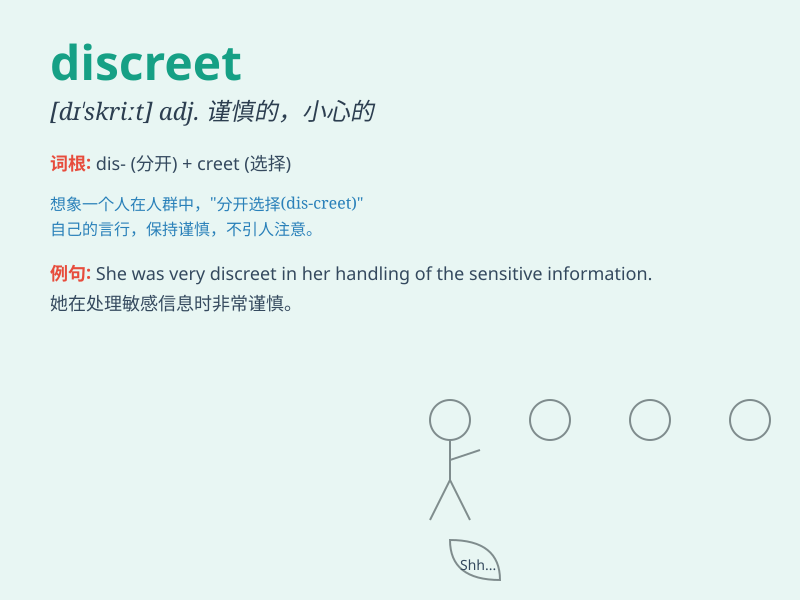

## discreet

**英音:** _[dɪ\'skriːt]_ **美音:** _[dɪ\'skrit]_

**译义:** *adj.小心的,慎重的,有思虑的,贤明的*

### 短语

+ **be discreet:** _谨慎行事_

+ **discreet behavior:** _谨慎的行为_

+ **discreet inquiry:** _谨慎的询问_

+ **discreet silence:** _谨慎的沉默_

+ **discreet choice:** _谨慎的选择_

### 例句

#### 例句1

> **She is always discreet when discussing personal matters.**

**中文翻译:** 在讨论个人事务时，她总是很谨慎。

**单词释义:** 谨慎的；小心的

#### 例句2

> **The doctor was discreet and didn\'t reveal the patient\'s
condition to others.**

**中文翻译:** 医生很谨慎，没有向其他人透露病人的病情。

**单词释义:** 谨慎的；慎重的

#### 例句3

> **He made a discreet inquiry about the job vacancy.**

**中文翻译:** 他谨慎地询问了职位空缺的情况。

**单词释义:** 谨慎的；不显眼的

### 背诵小故事

> A spy needed to be discreet. One day, while on a mission, he hid the
secret documents carefully and acted calmly. No one suspected him
because of his discreet behavior.

**一名间谍需要谨慎。有一天，在执行任务时，他小心地藏好秘密文件，表现得很沉着。由于他谨慎的行为，没有人怀疑他。**

### 图义

