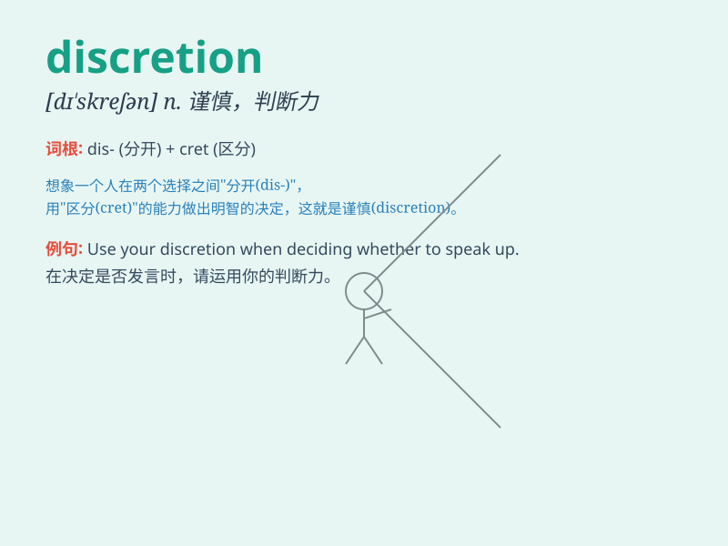

## discretion

**英音:** _[dɪ\'skreʃ(ə)n]_ **美音:** _[dɪ\'skrɛʃən]_

**译义:** *n.判断力*

### 短语

+ **at one\'s discretion:** _随某人之便；由某人自行决定_

+ **use discretion:** _谨慎使用；酌情处理_

+ **discretionary power:** _自由裁量权；自行决定权_

+ **act at discretion:** _任意行事；自由行动_

+ **within one\'s discretion:** _在某人的自行决定权范围内_

### 例句

#### 例句1

> **The manager has the discretion to make important decisions.**

**中文翻译:** 经理有权做出重要决定。

**单词释义:** 自行决定权；斟酌处理的权力

#### 例句2

> **You should use your discretion when dealing with this matter.**

**中文翻译:** 处理此事时，您应该谨慎行事。

**单词释义:** 自行决定；斟酌

#### 例句3

> **The judge has wide discretion in sentencing.**

**中文翻译:** 法官在量刑时拥有广泛的自由裁量权。

**单词释义:** 裁量权；酌处权

### 背诵小故事

> A spy needed to use discretion when handling secret documents. If
not, the enemy would discover their plans. Discretion means the quality
of being careful and using good judgment to avoid causing harm or giving
away secrets.

**一名间谍在处理秘密文件时需要谨慎行事。否则，敌人就会发现他们的计划。discretion
这个词意为谨慎、判断力，即小心行事以避免造成伤害或泄露秘密。**

### 图义

