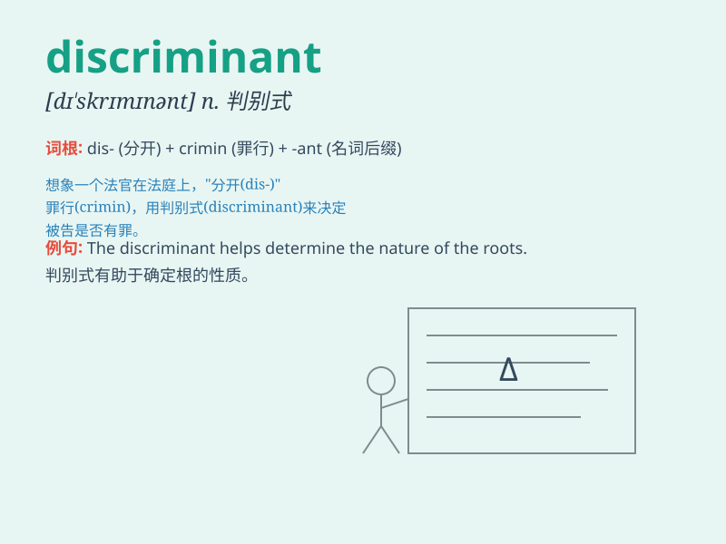

## discriminant

**英音:** _[dɪ\'skrɪmɪnənt]_ **美音:**
_[dɪ\'skrɪmənənt]_

**译义:** * [计] 判别式*

### 短语

+ **discriminant function:** _判别函数_

+ **quadratic discriminant:** _二次判别式_

+ **discriminant analysis:** _判别分析_

+ **characteristic discriminant:** _特征判别式_

+ **discriminant criterion:** _判别准则_

### 例句

#### 例句1

> **The discriminant of the quadratic equation determines the nature
of its roots.**

**中文翻译:** 二次方程的判别式决定了其根的性质。

**单词释义:** 判别式

#### 例句2

> **In mathematics, the discriminant is a crucial concept for solving
certain types of equations.**

**中文翻译:** 在数学中，判别式是求解某些类型方程的关键概念。

**单词释义:** 判别式

#### 例句3

> **The discriminant helps us distinguish between different cases in
the study of functions.**

**中文翻译:** 判别式帮助我们在函数研究中区分不同的情况。

**单词释义:** 判别式

### 背诵小故事

> In a magical math land, there was a special key called the
\'discriminant\' that could unlock the secrets of quadratic equations.
It was like a magic wand that told us whether the equation had two, one,
or no real solutions.

**在一个神奇的数学王国里，有一把特殊的钥匙叫'判别式'，它能揭开二次方程的秘密。它就像一根魔法棒，告诉我们方程有两个、一个还是没有实数解。**

### 图义

