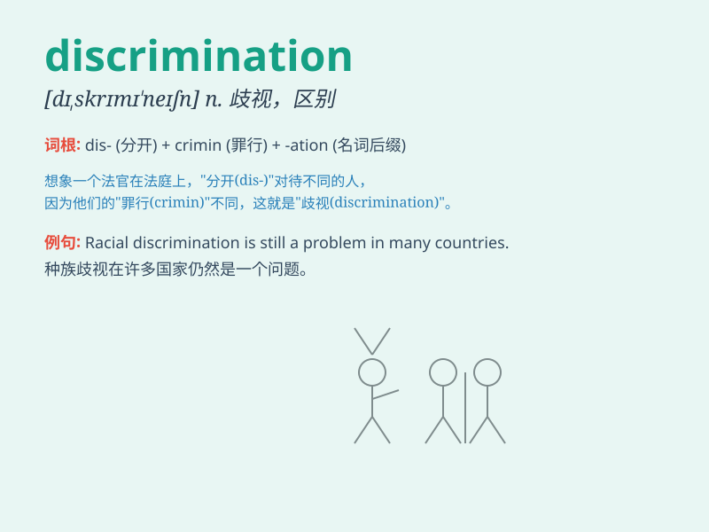

## discrimination

**英音:** _[dɪ,skrɪmɪ\'neɪʃ(ə)n]_ **美音:**
_[dɪ,skrɪmɪ\'neʃən]_

**译义:** *n.辨别,区别,识别力,辨别力,歧视*

### 短语

+ **racial discrimination:** _种族歧视_

+ **gender discrimination:** _性别歧视_

+ **employment discrimination:** _就业歧视_

+ **price discrimination:** _价格歧视_

+ **age discrimination:** _年龄歧视_

### 例句

#### 例句1

> **Racial discrimination is still a serious problem in some
countries.**

**中文翻译:** 种族歧视在一些国家仍然是一个严重问题。

**单词释义:** 歧视；区别对待

#### 例句2

> **The company has a policy against gender discrimination.**

**中文翻译:** 公司制定了反对性别歧视的政策。

**单词释义:** 歧视

#### 例句3

> **His sharp discrimination enabled him to make the right
choice.**

**中文翻译:** 他敏锐的辨别力使他做出了正确的选择。

**单词释义:** 辨别力；鉴别力

### 背诵小故事

> A brave student named Lily fought against discrimination in her
school. Some teachers treated students differently based on their looks.
Lily spoke up, saying this was unfair. Her action made the school change
and end the discrimination.

**一位勇敢的名叫莉莉的学生在她的学校里与歧视作斗争。一些老师根据学生的外表区别对待他们。莉莉站出来说这是不公平的。她的行动使学校改变并结束了歧视。**

### 图义

