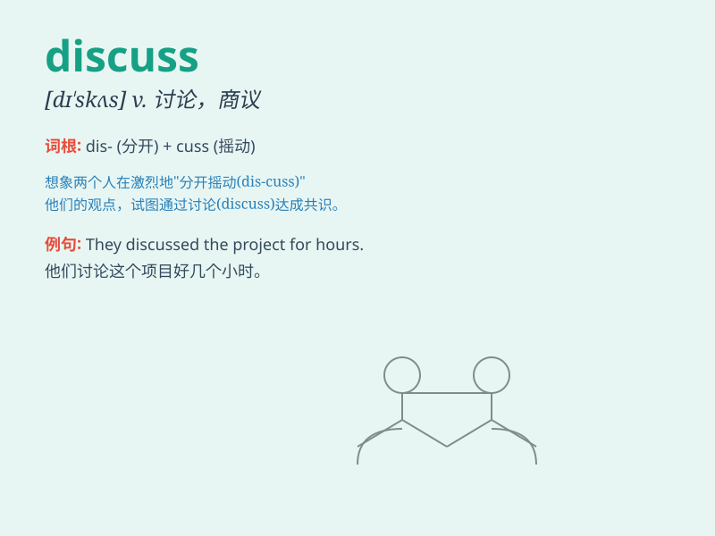

## discuss

**英音:** _[dɪ\'skʌs]_ **美音:** _[dɪ\'skʌs]_

**译义:** *vt.讨论,论述*

### 短语

+ **discuss in detail:** _详细讨论_

+ **discuss with sb:** _与某人讨论_

+ **discuss thoroughly:** _彻底讨论_

+ **discuss the matter:** _讨论这件事_

+ **openly discuss:** _公开讨论_

### 例句

#### 例句1

> **We need to discuss the plan carefully.**

**中文翻译:** 我们需要仔细讨论这个计划。

**单词释义:** 讨论

#### 例句2

> **Let\'s discuss this matter at the meeting.**

**中文翻译:** 我们在会议上讨论这个问题吧。

**单词释义:** 讨论

#### 例句3

> **They are discussing the best way to solve the problem.**

**中文翻译:** 他们正在讨论解决问题的最佳方法。

**单词释义:** 讨论

### 背诵小故事

> A group of friends were in a room. They had different ideas about a
trip. So they began to discuss it loudly. They shared thoughts and
finally made a good plan.

**一群朋友在一个房间里。他们对于一次旅行有不同的想法。所以他们开始大声地讨论。他们分享想法，最终制定了一个好计划。**

### 图义

