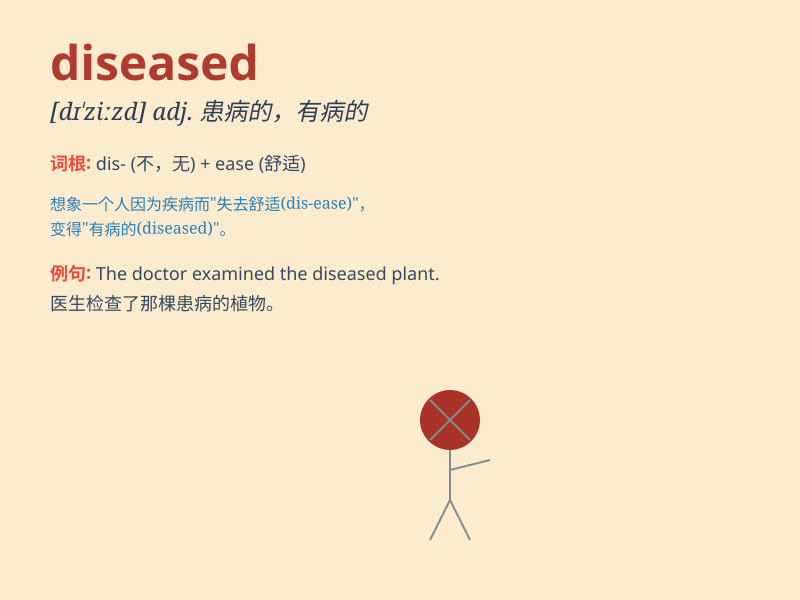

## diseased

**英音:** _[dɪˈziːzd]_ **美音:** _[dɪˈziːzd]_

**译义:** *adj.患病的,败坏的,有病*

### 短语

+ **diseased tissue:** _病变组织_

+ **diseased plant:** _患病的植物_

+ **diseased condition:** _患病状况_

+ **diseased liver:** _病变的肝脏_

+ **diseased mind:** _病态的心理_

### 例句

#### 例句1

> **The diseased tree was cut down to prevent the spread of the
disease.**

**中文翻译:** 为了防止疾病蔓延，病树被砍掉了。

**单词释义:** 患病的

#### 例句2

> **His lungs were diseased and he had trouble breathing.**

**中文翻译:** 他的肺部患病，呼吸困难。

**单词释义:** 有病的

#### 例句3

> **The doctor examined the diseased tissue under the microscope.**

**中文翻译:** 医生在显微镜下检查患病组织。

**单词释义:** 患病的

### 背诵小故事

> One day, a farmer found that some of his plants looked weak and
unhealthy. He realized they were diseased. He quickly took action to
save the rest of the crops.

**一天，一个农民发现他的一些植物看起来虚弱且不健康。他意识到它们生病了。他迅速采取行动来拯救其余的庄稼。**

### 图义

