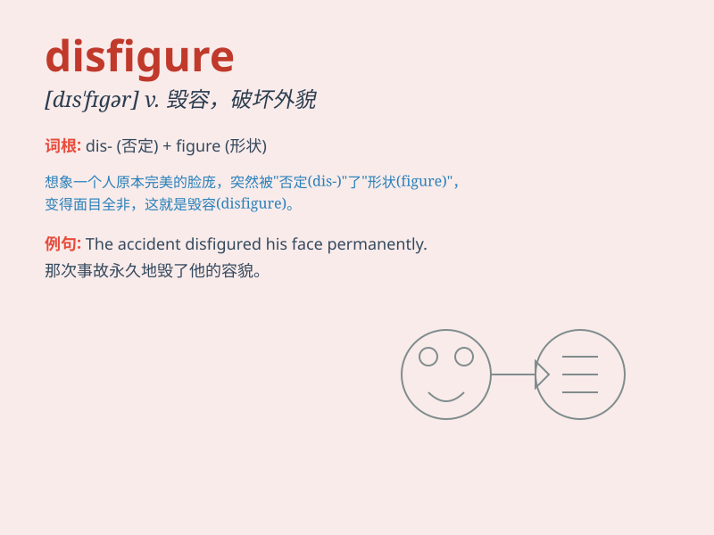

## disfigure

**英音:** _[dɪs\'fɪgə]_ **美音:** _[dɪs\'fɪɡjɚ]_

**译义:** *v.损伤外貌,使变丑*

### 短语

+ **disfigure one\'s face:** _毁了某人的脸_

+ **disfigure the landscape:** _破坏景观_

+ **be disfigured by:** _被\...\...毁容_

+ **disfigure severely:** _严重毁容_

+ **disfigure permanently:** _永久性毁容_

### 例句

#### 例句1

> **The accident disfigured her face permanently.**

**中文翻译:** 这场事故使她的脸永远毁容了。

**单词释义:** 使变丑；损毁...的外形

#### 例句2

> **The graffiti disfigured the beautiful wall.**

**中文翻译:** 那些涂鸦损毁了这面漂亮的墙。

**单词释义:** 破坏...的外观

#### 例句3

> **Years of neglect had disfigured the old building.**

**中文翻译:** 多年的疏于管理使这座老建筑变得破败不堪。

**单词释义:** 使难看；使失色

### 背诵小故事

> A beautiful princess was kidnapped by an evil witch. The witch cast a
spell to disfigure the princess, making her face ugly. But in the end, a
brave prince found a way to break the spell and restore her beauty.

**一位美丽的公主被一个邪恶的女巫绑架了。女巫施了一个法术使公主毁容，让她的脸变得丑陋。但最后，一位勇敢的王子找到了打破法术的方法，恢复了她的美貌。**

### 图义

