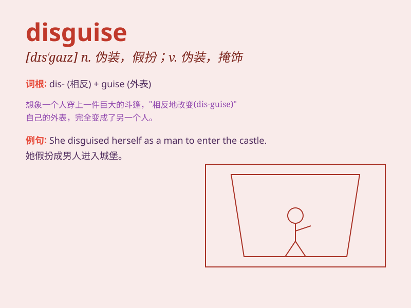

## disguise

**英音:** _[dɪs\'gaɪz]_ **美音:** _[dɪs\'ɡaɪz]_

**译义:** *v.假装,伪装,掩饰n.伪装*

### 短语

+ **in disguise:** _伪装；乔装_

+ **disguise oneself as:** _把自己伪装成\...\..._

+ **throw off/disguise one\'s identity:** _隐瞒/掩盖自己的身份_

+ **disguise one\'s feelings:** _掩饰自己的感情_

+ **a perfect disguise:** _完美的伪装_

### 例句

#### 例句1

> **She wore a disguise to avoid being recognized.**

**中文翻译:** 她戴了个伪装以免被认出来。

**单词释义:** 伪装；假扮

#### 例句2

> **The thief tried to disguise himself as a delivery man.**

**中文翻译:** 那个小偷试图把自己伪装成送货员。

**单词释义:** 伪装；假扮

#### 例句3

> **He managed to disguise his voice on the phone.**

**中文翻译:** 他在电话里设法伪装了自己的声音。

**单词释义:** 伪装；掩饰

### 背诵小故事

> One day, a spy needed to enter the enemy\'s base. He put on a strange
costume and changed his appearance to disguise himself. With this
disguise, no one recognized him and he successfully completed his
mission.

**有一天，一名间谍需要进入敌人的基地。他穿上了奇怪的服装并改变了自己的外貌来伪装自己。凭借这个伪装，没人认出他，他成功完成了任务。**

### 图义

