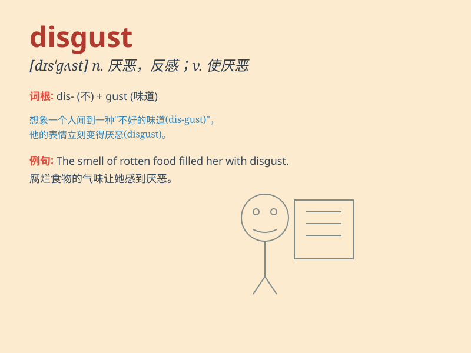

## disgust

**英音:** _[dɪs\'gʌst]_ **美音:** _[dɪs\'ɡʌst]_

**译义:** *n.厌恶,嫌恶vi.令人厌恶,令人反感vt.使作呕*

### 短语

+ **in disgust:** _厌恶地；反感地_

+ **disgust at:** _对\...\...感到厌恶_

+ **feel disgust:** _感到厌恶_

+ **disgust with:** _对\...\...的厌恶_

+ **to one\'s disgust:** _令某人厌恶的是_

### 例句

#### 例句1

> **The smell of the rotten food filled me with disgust.**

**中文翻译:** 腐烂食物的气味让我感到厌恶。

**单词释义:** 厌恶，反感

#### 例句2

> **His behavior disgusted everyone at the party.**

**中文翻译:** 他的行为让聚会上的每个人都感到厌恶。

**单词释义:** 使厌恶，使反感

#### 例句3

> **She looked at him in disgust when he told the lie.**

**中文翻译:** 当他说谎时，她厌恶地看着他。

**单词释义:** 厌恶，嫌恶

### 背诵小故事

> One day, I went to a dirty restaurant. The smell and the sight of the
food there filled me with disgust. I couldn\'t stand it and left
immediately.

**有一天，我去了一家脏兮兮的餐厅。那里食物的气味和样子让我感到厌恶。我受不了，马上就离开了。**

### 图义

