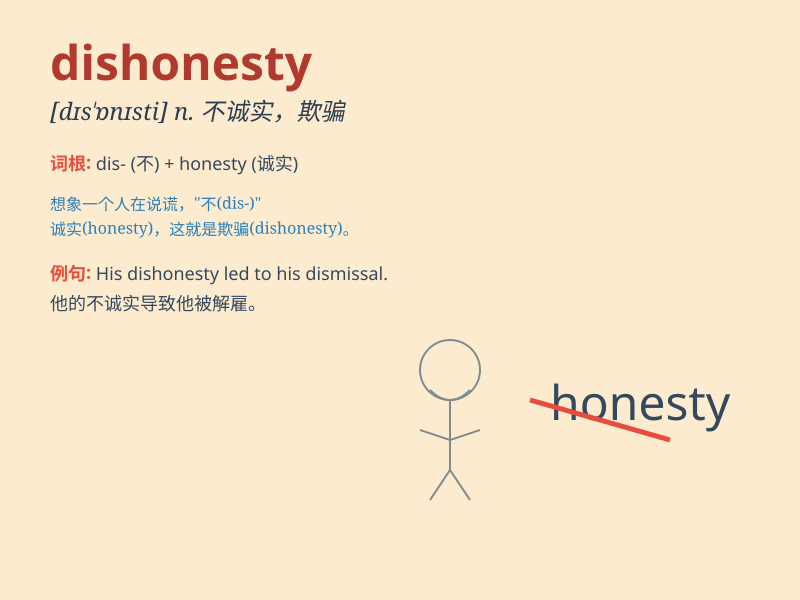

## dishonesty

**英音:** _[dɪs\'ɒnɪstɪ]_ **美音:** _[dɪs\'ɑnɪsti]_

**译义:** *n.不诚实,不老实,欺骗,欺诈*

### 短语

+ **act of dishonesty:** _不诚实的行为_

+ **expose dishonesty:** _揭露不诚实_

+ **dishonesty in business:** _商业中的不诚实_

+ **punish dishonesty:** _惩罚不诚实_

+ **root out dishonesty:** _根除不诚实_

### 例句

#### 例句1

> **His dishonesty cost him his job.**

**中文翻译:** 他的不诚实使他丢了工作。

**单词释义:** 不诚实

#### 例句2

> **We should avoid any form of dishonesty in our relationships.**

**中文翻译:** 在我们的关系中，我们应该避免任何形式的不诚实。

**单词释义:** 不诚实

#### 例句3

> **The politician was accused of dishonesty during the campaign.**

**中文翻译:** 这位政治家在竞选期间被指控不诚实。

**单词释义:** 不诚实

### 背诵小故事

> One day, Tom was accused of dishonesty. He had stolen money from his
friend\'s wallet and denied it. But in the end, his conscience made him
confess. This showed the bad consequence of dishonesty.

**一天，汤姆被指控不诚实。他从朋友的钱包里偷了钱却否认。但最终，他的良心让他坦白了。这显示了不诚实的不良后果。**

### 图义

