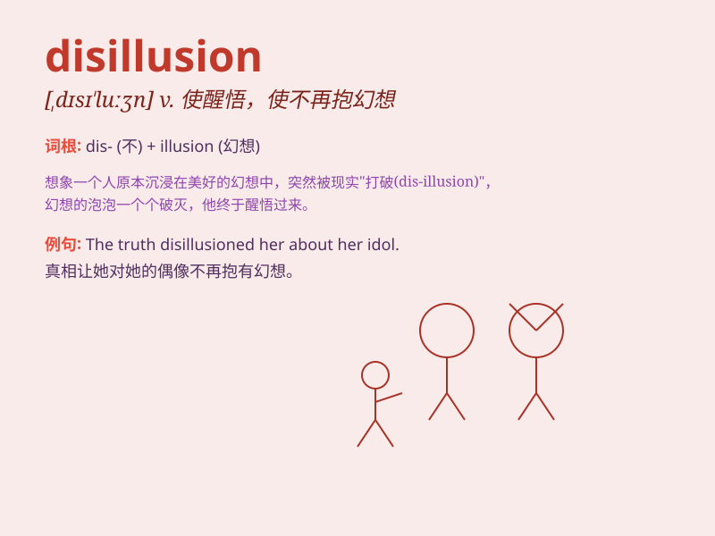

## disillusion

**英音:** _[,dɪsɪ\'l(j)uːʒ(ə)n]_ **美音:**
_[,dɪsɪ\'luʒn]_

**译义:** *v.醒悟*

### 短语

+ **disillusion with:** _对\...\...不再抱有幻想_

+ **be disillusioned about:** _对\...\...感到失望_

+ **disillusion someone of something:**
_使某人对某事不再抱有幻想_

+ **fall into disillusion:** _陷入幻想破灭_

+ **total disillusion:** _完全的幻想破灭_

### 例句

#### 例句1

> **The failure of his business disillusioned him completely.**

**中文翻译:** 他生意上的失败使他完全幻想破灭。

**单词释义:** 使幻想破灭

#### 例句2

> **She was disillusioned with the false promises of fame and
fortune.**

**中文翻译:** 她对名利的虚假承诺感到失望。

**单词释义:** 使不再抱幻想

#### 例句3

> **His behavior disillusioned me about his true character.**

**中文翻译:** 他的行为让我对他的真实性格不再抱有幻想。

**单词释义:** 使醒悟

### 背诵小故事

> A young man had high hopes for a certain job. But when he saw the
reality, it was full of chaos and unfairness. This experience brought
him disillusion, making him lose the illusion he once had.

**一个年轻人对某份工作抱有很高的期望。但当他看到现实时，充满了混乱和不公平。这次经历给他带来了幻灭，使他失去了曾经的幻想。**

### 图义

