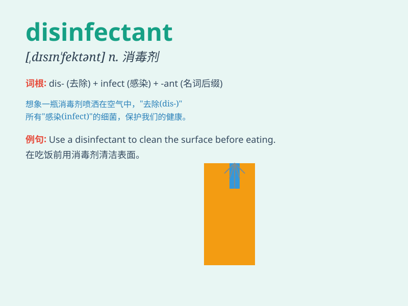

## disinfectant

**英音:** _[dɪsɪn\'fekt(ə)nt]_ **美音:**
_[\'dɪsɪn\'fɛktənt]_

**译义:** *n.消毒剂*

### 短语

+ **disinfectant spray:** _消毒喷雾_

+ **disinfectant solution:** _消毒溶液_

+ **chemical disinfectant:** _化学消毒剂_

+ **surface disinfectant:** _表面消毒剂_

+ **hospital disinfectant:** _医院消毒剂_

### 例句

#### 例句1

> **The nurse used a powerful disinfectant to clean the wound.**

**中文翻译:** 护士用了一种强效的消毒剂来清洁伤口。

**单词释义:** 消毒剂

#### 例句2

> **This disinfectant is effective against most germs.**

**中文翻译:** 这种消毒剂对大多数细菌都有效。

**单词释义:** 消毒剂

#### 例句3

> **We need to spray the disinfectant in the room to prevent the
spread of disease.**

**中文翻译:** 我们需要在房间里喷洒消毒剂以防止疾病传播。

**单词释义:** 消毒剂

### 背诵小故事

> One day, a virus outbreak happened. People were in panic. Luckily, we
found the disinfectant to clean and kill the germs. It was like a magic
weapon that made our world safe again.

**有一天，病毒爆发了。人们陷入恐慌。幸运的是，我们找到了消毒剂来清洁和杀死细菌。它就像一件神奇的武器，让我们的世界再次安全。**

### 图义

