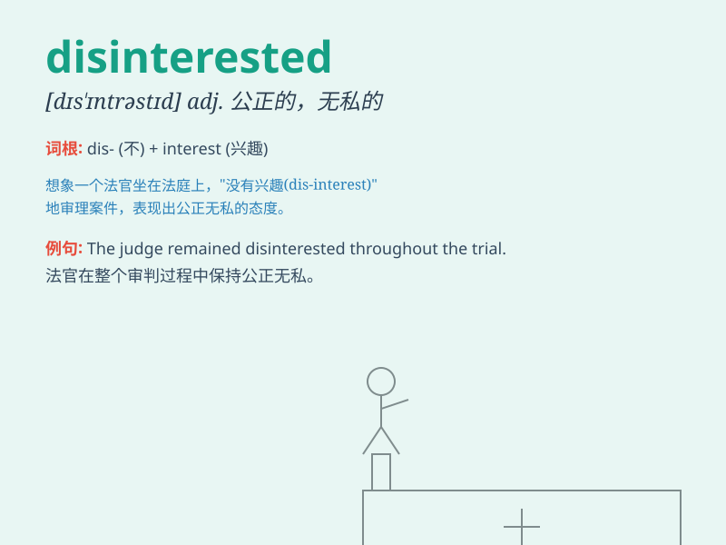

## disinterested

**英音:** _[dɪs\'ɪnt(ə)rɪstɪd]_ **美音:**
_[dɪs\'ɪntərɪsɪd]_

**译义:** *adj.无私的*

### 短语

+ **disinterested party:** _公正的一方；无利害关系的一方_

+ **disinterested observer:** _公正的观察者；无偏见的观察者_

+ **remain disinterested:** _保持公正；保持无私_

+ **disinterested advice:** _公正的建议；无私的建议_

+ **act disinterestedly:** _表现得公正无私_

### 例句

#### 例句1

> **The judge should be disinterested in the case to ensure a fair
trial.**

**中文翻译:** 法官应该对这个案件保持公正无私，以确保公正审判。

**单词释义:** 公正无私的

#### 例句2

> **We need a disinterested party to mediate the dispute.**

**中文翻译:** 我们需要一个公正无私的第三方来调解这场争端。

**单词释义:** 公正的；无私心的

#### 例句3

> **His advice seemed disinterested, but I later realized he had an
ulterior motive.**

**中文翻译:** 他的建议看起来是公正无私的，但后来我意识到他别有用心。

**单词释义:** 没有私心的

### 背诵小故事

> A judge must be disinterested. Imagine a judge in a courtroom. If he
has personal interests or biases, justice could be skewed. But a
disinterested judge makes fair decisions based solely on the law and
facts, without any self-interest.

**法官必须公正无私。想象一下法庭上的法官，如果他有个人利益或偏见，正义可能会被扭曲。但公正无私的法官仅依据法律和事实做出公平的裁决，没有任何私利。**

### 图义

