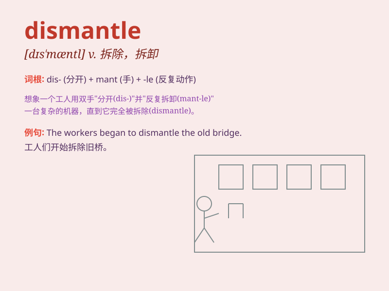

## dismantle

**英音:** _[dɪs\'mænt(ə)l]_ **美音:** _[dɪs\'mæntl]_

**译义:** *v.拆除*

### 短语

+ **dismantle a machine:** _拆卸一台机器_

+ **dismantle a structure:** _拆除一个结构_

+ **dismantle a system:** _瓦解一个系统_

+ **dismantle an organization:** _解散一个组织_

+ **dismantle a theory:** _推翻一个理论_

### 例句

#### 例句1

> **They decided to dismantle the old factory and build a shopping
mall instead.**

**中文翻译:** 他们决定拆除旧工厂，改建成一个购物中心。

**单词释义:** 拆除，拆卸

#### 例句2

> **The government is planning to dismantle the welfare system
gradually.**

**中文翻译:** 政府正计划逐步废除福利制度。

**单词释义:** 废除，取消

#### 例句3

> **He dismantled the machine to see how it worked.**

**中文翻译:** 他把机器拆开，看看它是如何运转的。

**单词释义:** 拆开，分解

### 背诵小故事

> A group of workers was assigned to dismantle an old factory. They
carefully took apart the machines and structures piece by piece. The
process of dismantling was like solving a big puzzle.

**一群工人被派去拆除一座旧工厂。他们小心翼翼地把机器和建筑一块一块地拆开。拆除的过程就像在解一个大谜题。**

### 图义

