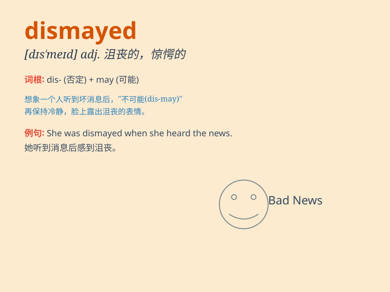

## dismayed

**英音:** _[dɪsˈmeɪd]_ **美音:** _[dɪsˈmeɪd]_

**译义:** *adj. 惊愕的；焦虑的；气馁的*

### 短语

+ **be dismayed at:** _对\...\...感到沮丧_

+ **feel dismayed:** _感到沮丧_

+ **utterly dismayed:** _完全沮丧_

+ **deeply dismayed:** _深感沮丧_

+ **greatly dismayed:** _非常沮丧_

### 例句

#### 例句1

> **I was dismayed at the news of his failure.**

**中文翻译:** 听到他失败的消息我感到很沮丧。

**单词释义:** 感到沮丧

#### 例句2

> **She looked dismayed when she saw the damaged vase.**

**中文翻译:** 当她看到那个损坏的花瓶时，她看起来很惊愕。

**单词释义:** 惊愕的

#### 例句3

> **The teacher was dismayed by the students\' poor performance.**

**中文翻译:** 老师对学生们的糟糕表现感到失望。

**单词释义:** 失望的

### 背诵小故事

> A young artist entered a competition but was dismayed when his
masterpiece wasn\'t chosen. He felt very disappointed and sad. But he
didn\'t give up and continued to create. Disappointed and sad is what
\'dismayed\' means.

**一位年轻的艺术家参加了一场比赛，但当他的杰作未被选中时，他感到很沮丧。他非常失望和难过。但他没有放弃，继续创作。失望和难过就是\'dismayed\'的意思。**

### 图义

