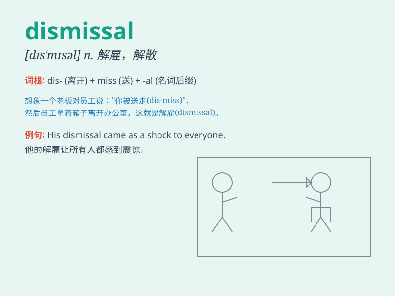

## dismissal

**英音:** _[dɪs\'mɪsl]_ **美音:** _[dɪs\'mɪsl]_

**译义:** *n.免职,解雇,不予考虑*

### 短语

+ **summary dismissal:** _立即解雇；即时辞退_

+ **wrongful dismissal:** _不正当解雇；非法解雇_

+ **dismissal letter:** _解雇信；辞退信_

+ **dismissal notice:** _解雇通知；辞退通知_

+ **dismissal procedure:** _解雇程序；辞退程序_

### 例句

#### 例句1

> **His dismissal from the company came as a shock to everyone.**

**中文翻译:** 他被公司解雇让每个人都感到震惊。

**单词释义:** 解雇；开除

#### 例句2

> **The coach\'s dismissal of the player\'s poor performance was
harsh.**

**中文翻译:** 教练对这名球员糟糕表现的不予理会是很严厉的。

**单词释义:** 不予理会；摒弃

#### 例句3

> **The judge\'s dismissal of the case was based on insufficient
evidence.**

**中文翻译:** 法官因证据不足驳回了这个案子。

**单词释义:** 驳回；撤销

### 背诵小故事

> A hardworking employee was wrongly accused at work. Despite his
efforts to explain, the boss showed no mercy and gave him a dismissal.
This was an unfair and sad dismissal that left him heartbroken.

**一位勤奋的员工在工作中被冤枉了。尽管他努力解释，老板却毫不留情，给了他解雇通知。这是一次不公平且令人伤心的解雇，让他心碎。**

### 图义

