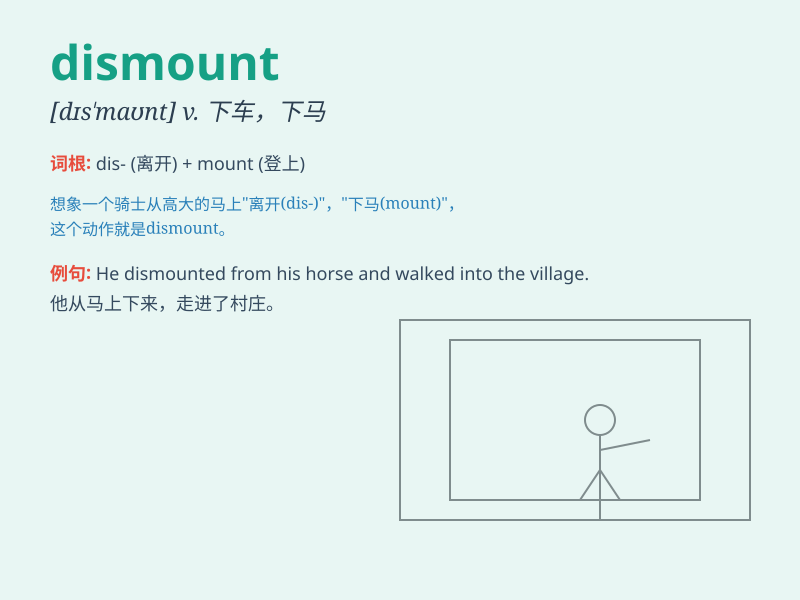

## dismount

**英音:** _[dɪs\'maʊnt]_ **美音:** _[dɪs\'maʊnt]_

**译义:** *v.(使)下马*

### 短语

+ **dismount from a horse:** _从马上下来_

+ **dismount a bicycle:** _从自行车上下来_

+ **forced dismount:** _被迫下马；被迫下车_

+ **dismount gracefully:** _优雅地下马；优雅地下车_

+ **dismount safely:** _安全下马；安全下车_

### 例句

#### 例句1

> **The knight dismounted from his horse.**

**中文翻译:** 这位骑士从他的马上下来了。

**单词释义:** 下马；下车

#### 例句2

> **She had to dismount the bike when the chain broke.**

**中文翻译:** 当链条断了时，她不得不从自行车上下来。

**单词释义:** 从（自行车、摩托车等）下来

#### 例句3

> **The gymnast dismounted the balance beam gracefully.**

**中文翻译:** 这位体操运动员优雅地从平衡木上下来。

**单词释义:** 从（平衡木等）下来

### 背诵小故事

> A brave knight was riding his horse in a fierce battle. But when the
danger passed, he decided to dismount. He gently slid off the horse\'s
back and gave the horse a pat, showing it was time to rest.

**一位勇敢的骑士在激烈的战斗中骑着他的马。但当危险过去后，他决定下马。他轻轻地从马背上滑下来，拍了拍马，示意是时候休息了。**

### 图义

