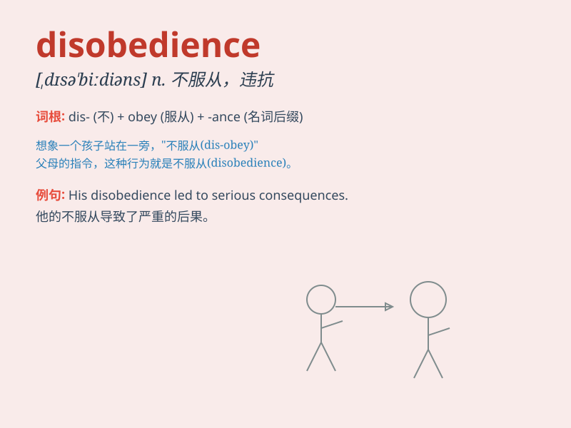

## disobedience

**英音:** _[dɪsə\'biːdɪəns]_ **美音:**
_[,dɪsə\'bidɪəns]_

**译义:** *n.不服从,违抗*

### 短语

+ **act of disobedience:** _不服从的行为_

+ **show disobedience:** _表现出不服从_

+ **disobedience to authority:** _对权威的不服从_

+ **punish disobedience:** _惩罚不服从_

+ **habitual disobedience:** _习惯性不服从_

### 例句

#### 例句1

> **His disobedience to the teacher\'s instructions got him into
trouble.**

**中文翻译:** 他不服从老师的指示，使他陷入了麻烦。

**单词释义:** 不服从，违抗

#### 例句2

> **The act of disobedience led to her being punished.**

**中文翻译:** 这种违抗的行为导致她受到了惩罚。

**单词释义:** 违抗，不顺从

#### 例句3

> **Disobedience of the law is a serious offense.**

**中文翻译:** 不守法是一种严重的违法行为。

**单词释义:** 不遵守，违反

### 背诵小故事

> Once upon a time, a little boy showed disobedience to his parents. He
refused to clean his room when asked. This made his parents quite
unhappy. But later, he realized his mistake. Disobedience means not
obeying.

**从前，有个小男孩对他的父母表现出不服从。当被要求打扫房间时，他拒绝了。这让他的父母很不高兴。但后来，他意识到了自己的错误。disobedience
意思是不服从。**

### 图义

